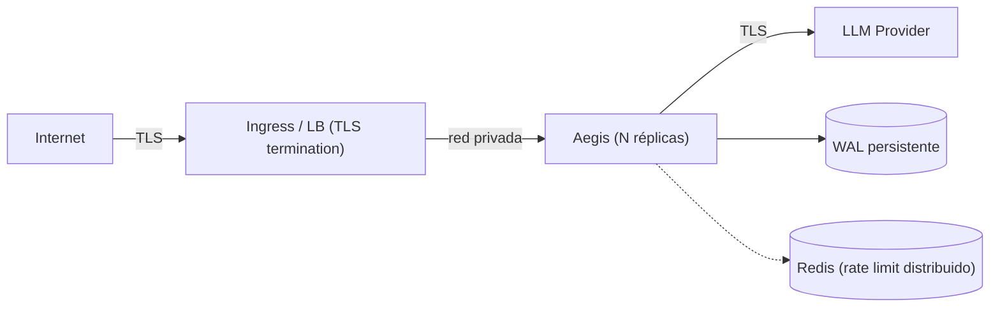

# Guía de Despliegue en Producción — Aegis Latent Core

> Alcance: cómo desplegar Aegis de forma segura en producción, qué garantías
> ofrece, y **qué NO hacer**. El modelo de amenazas (STRIDE) de
> [`docs/audit/SECURITY_AUDIT.md`](docs/audit/SECURITY_AUDIT.md) §7 informa cada
> recomendación. Las issues abiertas vienen de
> [`docs/audit/STATE.md`](docs/audit/STATE.md) §6 — leídas del código, no inferidas.

---

## 1. Prerrequisitos

| Componente | Mínimo | Nota |
|---|---|---|
| Python | 3.11+ | 3.12 recomendado |
| CPU | 2 vCPU | el data-plane es async; escala horizontal por réplicas |
| RAM | 512 MB + (≈ `max_memory_nodes` × ~1 KB) | la cadena en memoria es un deque acotado |
| Almacenamiento | persistente para el WAL | **no** efímero — ver §4 |
| Red saliente | hacia el proveedor LLM | restringida por allowlist si es posible |

El extension de Rust es opcional. Sin él, el path Python es la referencia
verificada (firma HMAC/Ed25519, MMR puro). Con él, ML-DSA (PQC) queda disponible.

---

## 2. Configuración mínima segura

```env
# Auth del proxy (clientes) y de los endpoints de auditoría (read-only).
AEGIS_API_KEYS=<clave-cliente-1>,<clave-cliente-2>
AEGIS_AUDIT_API_KEYS=<clave-readonly-auditoria>

# Clave HMAC DEDICADA para firmar la cadena (no reutilizar AEGIS_API_KEYS).
# Generar: python -c 'import secrets; print(secrets.token_hex(32))'
AEGIS_SIGNING_KEY=<64-hex>

# Proveedor upstream.
AEGIS_PROVIDER=openai
AEGIS_BACKEND_API_KEY=<clave-del-proveedor>

# WAL en disco persistente (ver §4).
AEGIS_WAL_PATH=/var/lib/aegis/aegis.wal.jsonl

# Producción: nunca debug, nunca auth deshabilitada.
AEGIS_DEBUG_MODE=false
```

`AEGIS_SIGNING_KEY` vacío degrada `legal_admissibility` a `"Compromised"`
(los nodos firman con Ed25519 efímero). **X→Y porque Z:** sin clave estable y
externa al host, la firma HMAC es falsificable server-side y la cadena pierde
valor probatorio frente a un tercero.

---

## 3. Topologías de despliegue

### 3a. Detrás de un balanceador que termina TLS (recomendado)



- Aegis escucha en una interfaz privada (`AEGIS_HOST=127.0.0.1` o red interna).
- El LB/ingress maneja el TLS público y, si aplica, mTLS de clientes.
- Varias réplicas comparten Redis para rate-limiting global y un backend de
  storage compartido (Postgres) para la cadena, si se requiere durabilidad
  multi-réplica.

### 3b. Aegis termina TLS directamente

```env
AEGIS_SSL_CERTFILE=/etc/certs/server.crt
AEGIS_SSL_KEYFILE=/etc/certs/server.key
# mTLS (requerir certificado de cliente):
AEGIS_MTLS_REQUIRED=true
AEGIS_SSL_CA_CERTS=/etc/certs/client-ca.crt
```

> Limitación conocida (L2 / I-05): los certs se aplican a uvicorn y al cliente
> httpx upstream, pero la **identidad** del certificado de cliente no se afirma
> por request. No uses mTLS como único control de autorización; combinalo con
> `AEGIS_API_KEYS`.

### 3c. Docker

```bash
docker run -p 8080:8080 \
  -v /var/lib/aegis:/var/lib/aegis \
  -e AEGIS_PROVIDER=anthropic \
  -e AEGIS_BACKEND_API_KEY=sk-ant-xxx \
  -e AEGIS_API_KEYS=$PROXY_KEY \
  -e AEGIS_AUDIT_API_KEYS=$AUDIT_KEY \
  -e AEGIS_SIGNING_KEY=$SIGNING_KEY \
  -e AEGIS_WAL_PATH=/var/lib/aegis/aegis.wal.jsonl \
  --memory=1g --cpus=2 \
  aegis-latent-core:2.4.0
```

Siempre fijá `--memory`/`--cpus` (requests+limits en K8s). El deque de la cadena
está acotado, pero el WAL crece sin rotación automática (ver §4).

---

## 4. Persistencia y custodia

| Tema | Acción | Por qué |
|---|---|---|
| WAL en disco persistente | volumen montado, no `tmpfs`/efímero | la cadena se reconstruye del WAL al arrancar; perderlo rompe la continuidad probatoria |
| Permisos del WAL | Aegis lo crea `0o600`; mantené el FS con dueño dedicado | el WAL guarda **hashes** (tenant_id, modelo, hashes de req/resp), no prompts — pero es metadata sensible |
| Backup del WAL | snapshot consistente periódico | un WAL corrupto detiene la reconstrucción y marca `fault_state` |
| Rotación | manual/operativa hoy (DoS abierto) | no hay rotación automática; monitoreá el tamaño |
| Rotación de clave | documentá el evento en la custodia | rotar `AEGIS_SIGNING_KEY` invalida la verificación HMAC de los nodos previos |
| Storage durable multi-réplica | `aegis_server` con Postgres/SQLite + exporter | para compliance SOC2/HIPAA con verificación independiente |

---

## 5. Qué NO hacer (anti-patrones)

| ❌ No hagas esto | Consecuencia | Correcto |
|---|---|---|
| Exponer `tools/visualizer/` a una red pública | el visualizer corre comandos locales (`git`, pytest, escaneo) y revela estructura interna | solo `127.0.0.1`, herramienta de dev |
| `AEGIS_DEBUG_MODE=true` en prod | publica `/docs`, `/redoc`, `/openapi.json` | `false` (default) |
| `AEGIS_AUTH_DISABLED=true` fuera de dev | abre el proxy y los endpoints de auditoría | bloqueado por validador: requiere `debug_mode=true` (fix #6) |
| Reutilizar `AEGIS_API_KEYS` como `AEGIS_SIGNING_KEY` | acoplar rotación de auth con firma de cadena | clave de firma dedicada |
| Dejar `AEGIS_SIGNING_KEY` vacío | `legal_admissibility="Compromised"` | siempre setearla |
| WAL en almacenamiento efímero | pérdida de la cadena al reiniciar | volumen persistente |
| Redis remoto sin TLS (I-04) | tokens de rate-limit / session IDs en claro | `ssl=True` + `ssl_cert_reqs=required` |
| Confiar en mTLS como autorización (L2) | identidad no afirmada por request | combinar con API keys |
| Exponer `/v1/audit/*` sin `AEGIS_AUDIT_API_KEYS` | lectura de metadata forense | clave read-only separada |

---

## 6. Modelo de amenazas (STRIDE) y postura

Resumen de [`SECURITY_AUDIT.md`](docs/audit/SECURITY_AUDIT.md) §7:

| Clase | Residual | Mitigación en despliegue |
|---|---|---|
| **T**ampering | WAL editable por atacante a nivel FS | firma cubre `prev_hash` (reorder se detecta, fix #2); clave fuera del host del WAL |
| **I**nfo disclosure | metadata forense en el WAL | WAL `0o600`; almacena hashes, no prompts |
| **E**oP | bypass por config `auth_disabled` | bloqueado salvo `debug_mode` (fix #6) |
| **R**epudiation | HMAC es simétrico → forja server-side posible | usar PQC/Ed25519 o Vault Transit para no-repudio fuerte |
| **D**oS | rate-limiter ante caída de Redis; SSE sin límite; crecimiento del WAL | controles del operador: límites de réplica, monitoreo del WAL |

**Issues abiertas a vigilar** (no resueltas, [`STATE.md`](docs/audit/STATE.md) §6):
`I-01` `os.fsync()` bajo lock sin timeout (un cuelgue de FS bloquea el pipeline);
`I-02` timeout de Vault; `I-03` timeouts por sentencia en storage; `I-04` TLS de Redis.

---

## 7. Observabilidad y health

| Endpoint | Uso |
|---|---|
| `GET /health` | liveness + estado de subsistemas (ledger, analyzer cache); 503 si degradado |
| `GET /ready` | readiness; 503 hasta completar el startup del lifespan |
| `GET /metrics` | Prometheus (extra `metrics`) |
| `GET /v1/audit/integrity` | verificación de la cadena (`AEGIS_AUDIT_API_KEYS`) |

Smoke test post-deploy:

```bash
AEGIS_BASE_URL=https://tu-aegis ./scripts/smoke_test.sh
```

---

## 8. Cadena de suministro (CI/CD)

`.github/workflows/`:

- **`ci.yml`** — Ruff (lint/format), Mypy (type check scoped a `mypy-ci.ini`),
  Bandit + `pip-audit` (seguridad), build/test de la extensión Rust, build de
  imagen Docker.
- **`release.yml`** — al taggear (`git tag vX.Y.Z && git push --tags`): genera
  `.whl`/`.tar.gz`, hashes **SHA-256** por artefacto, y publica el Release.
- **SBOM**: `scripts/generate_sbom.sh` (inventario de dependencias en JSON).
- **Firma de imagen**: Cosign en el pipeline de Docker.

Para publicar una versión: actualizá `pyproject.toml`, taggeá, y dejá que
GitHub Actions complete el resto.

---

## 9. Checklist de go-live

- [ ] `AEGIS_API_KEYS`, `AEGIS_AUDIT_API_KEYS`, `AEGIS_SIGNING_KEY` (dedicada) seteadas.
- [ ] `AEGIS_DEBUG_MODE=false`; `AEGIS_AUTH_DISABLED` ausente.
- [ ] WAL en volumen persistente con backup; permisos `0o600` verificados.
- [ ] TLS público (LB o Aegis directo); Redis con TLS si es remoto.
- [ ] Visualizer **no** expuesto públicamente.
- [ ] `GET /ready` y `GET /health` responden 200; `scripts/smoke_test.sh` pasa.
- [ ] `GET /v1/audit/integrity` → `valid=true`.
- [ ] Procedimiento de rotación de `AEGIS_SIGNING_KEY` documentado en la custodia.
- [ ] Límites de CPU/memoria fijados; monitoreo del tamaño del WAL activo.
