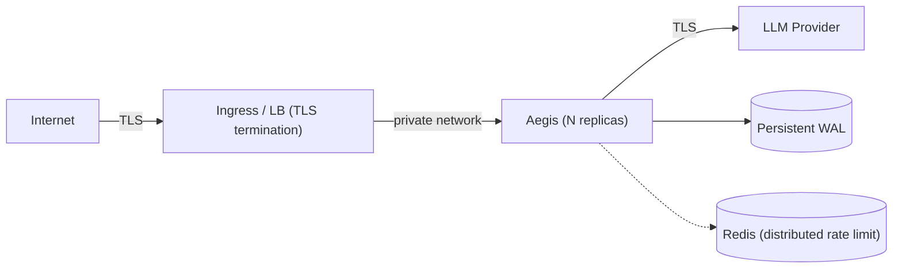

# Production Deployment Guide — Aegis Latent Core

> Scope: how to deploy Aegis securely in production, what guarantees it
> provides, and **what NOT to do**. Every recommendation is informed by the
> STRIDE threat model in
> [`docs/audit/SECURITY_AUDIT.md`](docs/audit/SECURITY_AUDIT.md) §7. Open
> issues are from [`docs/audit/STATE.md`](docs/audit/STATE.md) §6 — read from
> code, not inferred.

---

## 1. Prerequisites

| Component | Minimum | Note |
|---|---|---|
| Python | 3.11+ | 3.12 recommended |
| CPU | 2 vCPU | data plane is async; scale horizontally with replicas |
| RAM | 512 MB + (≈ `max_memory_nodes` × ~1 KB) | in-memory chain is a bounded deque |
| Storage | persistent for the WAL | **not** ephemeral — see §4 |
| Outbound network | to the LLM provider | restrict with an allowlist if possible |

The Rust extension is optional. Without it, the Python path is the verified
reference (HMAC/Ed25519 signing, pure-Python MMR). With it, ML-DSA (PQC)
becomes available and MMR throughput improves ~3× (see
[`docs/BENCHMARKS.md`](docs/BENCHMARKS.md) §Claim 2).

---

## 2. Minimum secure configuration

```env
# Auth keys for proxy clients and for audit endpoints (read-only).
AEGIS_API_KEYS=<client-key-1>,<client-key-2>
AEGIS_AUDIT_API_KEYS=<read-only-audit-key>

# DEDICATED HMAC key for signing the chain (do not reuse AEGIS_API_KEYS).
# Generate: python -c 'import secrets; print(secrets.token_hex(32))'
AEGIS_SIGNING_KEY=<64-hex>

# Upstream provider.
AEGIS_PROVIDER=openai
AEGIS_BACKEND_API_KEY=<provider-key>

# WAL on persistent disk (see §4).
AEGIS_WAL_PATH=/var/lib/aegis/aegis.wal.jsonl

# Production: never debug, never auth disabled.
AEGIS_DEBUG_MODE=false
```

An empty `AEGIS_SIGNING_KEY` downgrades `legal_admissibility` to
`"Compromised"` (nodes sign with an ephemeral Ed25519 key). **Why it
matters:** without a stable key external to the host, the HMAC signature is
forgeable server-side and the chain loses probative value against a third
party.

---

## 3. Deployment topologies

### 3a. Behind a TLS-terminating load balancer (recommended)



- Aegis listens on a private interface (`AEGIS_HOST=127.0.0.1` or internal
  network).
- The LB/ingress handles public TLS and, if applicable, client mTLS.
- Multiple replicas share Redis for global rate limiting and a shared storage
  backend (Postgres) for the chain, if multi-replica durability is required.

### 3b. Aegis terminates TLS directly

```env
AEGIS_SSL_CERTFILE=/etc/certs/server.crt
AEGIS_SSL_KEYFILE=/etc/certs/server.key
# mTLS (require a client certificate):
AEGIS_MTLS_REQUIRED=true
AEGIS_SSL_CA_CERTS=/etc/certs/client-ca.crt
```

> Known limitation (L2 / I-05): certs are applied to uvicorn and the upstream
> httpx client, but the **client-certificate identity is not asserted
> per-request**. Do not use mTLS as the sole authorization control; combine it
> with `AEGIS_API_KEYS`.

### 3c. Docker

```bash
docker run -p 8080:8080 \
  -v /var/lib/aegis:/var/lib/aegis \
  -e AEGIS_PROVIDER=anthropic \
  -e AEGIS_BACKEND_API_KEY=sk-ant-xxx \
  -e AEGIS_API_KEYS=$PROXY_KEY \
  -e AEGIS_AUDIT_API_KEYS=$AUDIT_KEY \
  -e AEGIS_SIGNING_KEY=$SIGNING_KEY \
  -e AEGIS_WAL_PATH=/var/lib/aegis/aegis.wal.jsonl \
  --memory=1g --cpus=2 \
  aegis-latent-core:2.4.1
```

Always set `--memory`/`--cpus` (requests+limits in K8s). The chain deque is
bounded, but the WAL grows without automatic rotation (see §4).

---

## 4. Persistence and custody

| Topic | Action | Why |
|---|---|---|
| WAL on persistent disk | mounted volume, not `tmpfs`/ephemeral | the chain is rebuilt from the WAL on startup; losing it breaks audit continuity |
| WAL permissions | Aegis creates it `0o600`; maintain a dedicated owner on the filesystem | the WAL stores **hashes** (tenant_id, model, req/resp hashes), not prompt bodies — but it is still sensitive metadata |
| WAL backup | periodic consistent snapshot | a corrupt WAL halts reconstruction and sets `fault_state` |
| Rotation | manual/operational today (open DoS risk) | no automatic rotation; monitor WAL size |
| Key rotation | document the event in chain-of-custody notes | rotating `AEGIS_SIGNING_KEY` invalidates HMAC verification for all prior nodes |
| Durable multi-replica storage | `aegis_server` with Postgres/SQLite + exporter | for SOC2/HIPAA compliance with independent verification |

---

## 5. What NOT to do (anti-patterns)

| ❌ Don't do this | Consequence | Correct approach |
|---|---|---|
| Expose `tools/visualizer/` to a public network | the visualizer runs local commands (`git`, pytest, scanning) and reveals internal structure | localhost only — development tool |
| `AEGIS_DEBUG_MODE=true` in production | publishes `/docs`, `/redoc`, `/openapi.json` | `false` (default) |
| `AEGIS_AUTH_DISABLED=true` outside dev | opens the proxy and audit endpoints to unauthenticated access | blocked by validator: requires `debug_mode=true` |
| Reuse `AEGIS_API_KEYS` as `AEGIS_SIGNING_KEY` | couples auth key rotation with chain signing | use a dedicated signing key |
| Leave `AEGIS_SIGNING_KEY` empty | `legal_admissibility="Compromised"` | always set it |
| WAL on ephemeral storage | chain lost on restart | persistent volume |
| Remote Redis without TLS (I-04) | rate-limit tokens / session IDs in cleartext | `ssl=True` + `ssl_cert_reqs=required` |
| Rely on mTLS as the sole authorization (L2) | identity not asserted per-request | combine with API keys |
| Expose `/v1/audit/*` without `AEGIS_AUDIT_API_KEYS` | forensic metadata readable without auth | separate read-only key |

---

## 6. Threat model (STRIDE) and posture

Summary from [`SECURITY_AUDIT.md`](docs/audit/SECURITY_AUDIT.md) §7:

| Class | Residual risk | Deployment mitigation |
|---|---|---|
| **T**ampering | WAL editable by an attacker with FS access | signing covers `prev_hash` (reordering detected); keep the key off the WAL host |
| **I**nfo disclosure | forensic metadata in the WAL | WAL `0o600`; stores hashes, not prompts |
| **E**levation of privilege | bypass via `auth_disabled` config | blocked unless `debug_mode` is also set |
| **R**epudiation | HMAC is symmetric → server-side forgery possible | use PQC/Ed25519 or Vault Transit for strong non-repudiation |
| **D**oS | rate limiter fails open on Redis outage; SSE without size limit; WAL growth | operator controls: replica limits, WAL monitoring |

**Open issues to watch** (unresolved, [`STATE.md`](docs/audit/STATE.md) §6):
`I-01` `os.fsync()` under lock without timeout (a FS hang blocks the pipeline);
`I-02` Vault auth has no explicit timeout; `I-03` no per-statement timeouts in
storage; `I-04` Redis TLS not enforced by default.

---

## 7. Observability and health

| Endpoint | Use |
|---|---|
| `GET /health` | liveness + subsystem state (ledger, analyzer cache); 503 if degraded |
| `GET /ready` | readiness; 503 until lifespan startup completes |
| `GET /metrics` | Prometheus (requires `metrics` extra) |
| `GET /v1/audit/integrity` | chain verification (`AEGIS_AUDIT_API_KEYS` required) |

Post-deploy smoke test:

```bash
AEGIS_BASE_URL=https://your-aegis ./scripts/smoke_test.sh
```

---

## 8. Supply chain (CI/CD)

`.github/workflows/`:

- **`ci.yml`** — Ruff (lint/format), Mypy (type check scoped to `mypy-ci.ini`),
  Bandit + `pip-audit` (security), Rust extension build/test, Docker image build.
- **`release.yml`** — on tag (`git tag vX.Y.Z && git push --tags`): generates
  `.whl`/`.tar.gz`, per-artifact **SHA-256** hashes, and publishes the Release.
- **SBOM**: `scripts/generate_sbom.sh` (JSON dependency inventory).
- **Image signing**: Cosign in the Docker pipeline.

To publish a release: update `pyproject.toml`, tag, and let GitHub Actions
do the rest.

---

## 9. Go-live checklist

- [ ] `AEGIS_API_KEYS`, `AEGIS_AUDIT_API_KEYS`, `AEGIS_SIGNING_KEY` (dedicated) set.
- [ ] `AEGIS_DEBUG_MODE=false`; `AEGIS_AUTH_DISABLED` absent.
- [ ] WAL on a persistent volume with backup; `0o600` permissions verified.
- [ ] Public TLS (LB or Aegis direct); Redis with TLS if remote.
- [ ] Visualizer **not** exposed publicly.
- [ ] `GET /ready` and `GET /health` return 200; `scripts/smoke_test.sh` passes.
- [ ] `GET /v1/audit/integrity` → `valid=true`.
- [ ] `AEGIS_SIGNING_KEY` rotation procedure documented in chain-of-custody notes.
- [ ] CPU/memory limits set; WAL size monitoring active.
