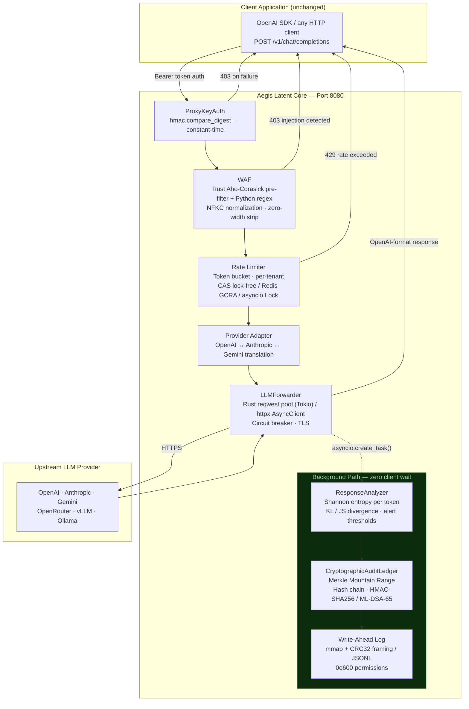
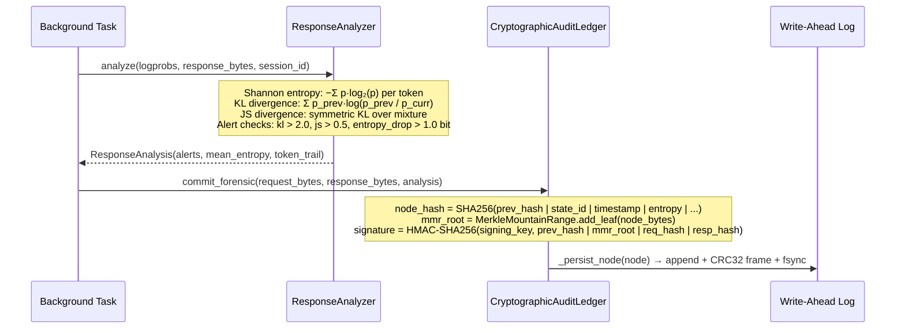
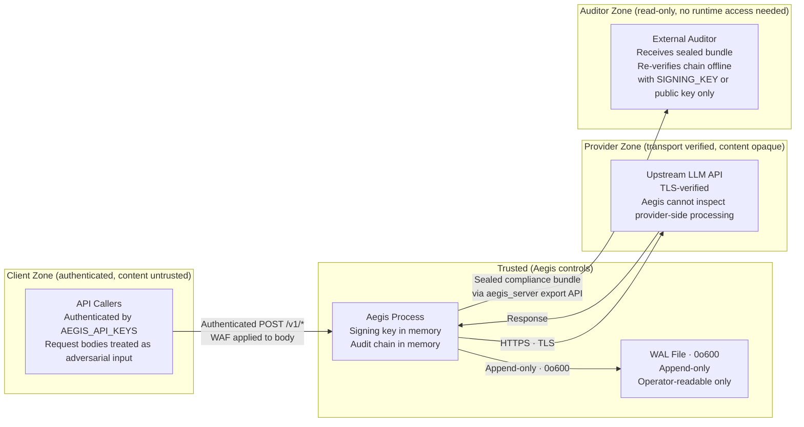

<div align="center">

# Aegis Latent Core


**Drop-in OpenAI-compatible inference governance proxy with cryptographically-signed, tamper-evident forensic audit chains. Zero application changes required.**

[](https://github.com/JuanLunaIA/aegis-latent-core/actions/workflows/ci.yml)
[](COMMERCIAL.md)
[](https://www.python.org/)
[](CHANGELOG.md)

</div>

---

## Table of Contents

1. [Key Guarantees](#key-guarantees)
2. [Non-Goals](#non-goals)
3. [Problem Statement](#problem-statement)
4. [Architecture Overview](#architecture-overview)
5. [Request Lifecycle](#request-lifecycle)
6. [Trust Boundaries](#trust-boundaries)
7. [Threat Model](#threat-model)
8. [Security Guarantees](#security-guarantees)
9. [Failure Modes](#failure-modes)
10. [Performance Characteristics](#performance-characteristics)
11. [Claims and Evidence](#claims-and-evidence)
12. [Quick Evaluation (5 minutes)](#quick-evaluation-5-minutes)
13. [Installation](#installation)
14. [Development Setup](#development-setup)
15. [Production Deployment](#production-deployment)
16. [Operational Checklist](#operational-checklist)
17. [Observability](#observability)
18. [Compliance Exports](#compliance-exports)
19. [Limitations](#limitations)
20. [Roadmap](#roadmap)
21. [Documentation Index](#documentation-index)

---

## Key Guarantees

The following guarantees are verifiable from source code and reproducible by any auditor.

| # | Guarantee | Mechanism | Verification |
|---|-----------|-----------|-------------|
| **G1** | Any post-hoc deletion, reordering, or field modification of an audit node is detectable | SHA-256 hash chain: `node[i].prev_hash == SHA256(node[i-1].content)`; full chain sweep via `verify_integrity()` | `pytest tests/test_security_fixes.py` |
| **G2** | The audit commit adds no I/O wait to the client-visible response path | `asyncio.create_task()` dispatched after `return JSONResponse(...)` — commit coroutine never `await`ed on the hot path | Code review: `aegis/proxy/app.py:_spawn_background()` |
| **G3** | Audit signatures are unforgeable without the signing key | `hmac.new(signing_key, payload, sha256)` per node; verified with `hmac.compare_digest()` (constant-time) | Code review: `aegis/core/crypto_audit.py:_sign_node()` |
| **G4** | The WAF is bypass-resistant against Unicode homoglyph and zero-width character injection | NFKC normalization applied before all pattern matching; explicit strip of U+200B/C/D/E/F, U+00AD, U+FEFF | Code review: `aegis/proxy/waf.py:_normalize()`; `pytest tests/test_waf*.py` |
| **G5** | API key comparison is timing-attack-resistant | `hmac.compare_digest()` used for all key comparisons | Code review: `aegis/proxy/auth.py:ProxyKeyAuth` |
| **G6** | The WAL file is readable only by the process owner | `os.chmod(path, 0o600)` set on creation | `stat $AEGIS_WAL_PATH` after first run |

---

## Non-Goals

Do not assume these properties. They are outside Aegis's design scope.

- **Content safety filtering** — Aegis blocks known injection patterns; it does not classify arbitrary harmful content
- **Upstream provider integrity** — Aegis cannot verify what a provider does with requests after they are forwarded
- **Defense against a compromised Aegis process** — if process memory or the signing key is extracted, an attacker can forge signatures
- **High availability / clustering** — single-node design; no built-in WAL replication or consensus
- **Complete WAF coverage** — pattern matching covers documented attack signatures; novel jailbreaks may pass
- **PII detection or body redaction** — `tenant_id` pseudonymization (SHA-256 prefix) is available; request/response body content is not scanned
- **Post-quantum transport security** — post-quantum signing covers the *audit record* only; transport to upstream uses standard TLS
- **Sub-millisecond upstream LLM latency** — Aegis adds ~80–1000 µs overhead; upstream model inference (100ms–3s) dominates the client-visible latency

---

## Problem Statement

Production LLM deployments face a compliance gap that standard logging cannot close:

**1. Provable record integrity.** Application logs capture *that* a call was made; they cannot prove *what* the model received and returned, nor that the record was not altered post-hoc. Regulated workloads (SOC2, HIPAA, FedRAMP) require evidence the record is tamper-evident.

**2. LLM-specific prompt injection.** Web WAFs and API gateways are not tuned for prompt injection: DAN prompts, instruction override, system-prompt exfiltration, Unicode homoglyph evasion, and template injection require LLM-aware pattern matching with normalization.

**3. Statistical anomaly detection.** Sudden drops in per-token probability entropy during a streaming response can indicate model behaviour changes (fine-tuning detection, output manipulation, hallucination bursts) that are invisible at the application layer without access to `logprobs`.

**4. Multi-provider abstraction.** Teams using OpenAI, Anthropic, Gemini, and self-hosted models (vLLM, Ollama) maintain per-provider adapter code. A unified proxy with semantic compatibility eliminates this.

Aegis addresses all four by sitting transparently between the application and the upstream provider, requiring **zero changes to existing OpenAI-SDK client code**.

---

## Architecture Overview



### Acceleration Tiers

Aegis ships a 7-tier Rust acceleration layer compiled as a PyO3 extension (`aegis_rust`). Every tier has a pure-Python fallback; the extension is optional. The Python path is functionally complete.

| Tier | Component | Rust | Python Fallback | Status of speedup claim |
|------|-----------|------|-----------------|------------------------|
| 1 | HTTP Forwarder | Tokio + reqwest pool + hickory-dns | `httpx.AsyncClient` | Claimed; not benchmarked in `docs/BENCHMARKS.md` |
| 2 | WAF Pre-filter | Aho-Corasick SIMD (`aho-corasick` crate) | `re` module | Claimed; not benchmarked in `docs/BENCHMARKS.md` |
| 3 | Rate Limiter | Lock-free CAS token bucket (DashMap) | `asyncio.Lock` + `cachetools.TTLCache` | Claimed; not benchmarked in `docs/BENCHMARKS.md` |
| 4 | Session Store | DashMap sharded concurrent hashmap | `collections.OrderedDict` + `threading.RLock` | Claimed; not benchmarked |
| 5 | Audit Ring Buffer | `crossbeam::ArrayQueue` lock-free MPSC | `asyncio.Queue` | Claimed; not benchmarked |
| 6 | Write-Ahead Log | `memmap2` mmap + CRC32 framing | `os.fsync()` JSONL | Claimed; not benchmarked |
| 7 | Cryptography | BLAKE3 SIMD + ML-DSA-65 (FIPS 204) | `hashlib.sha256` + HMAC-SHA256 | Claimed; not benchmarked |

Tier 7 Rust MMR throughput (2.62×–3.14× speedup over Python) is the one claim with a measured benchmark. See [Performance Characteristics](#performance-characteristics).

---

## Request Lifecycle

### Hot Path — adds latency observable by the client

```mermaid
sequenceDiagram
    autonumber
    participant C as Client
    participant A as Aegis Proxy
    participant U as Upstream LLM

    C->>A: POST /v1/chat/completions<br/>Authorization: Bearer &lt;key&gt;

    Note over A: Auth: hmac.compare_digest()
    Note over A: WAF Layer 1: Aho-Corasick pre-filter
    Note over A: WAF Layer 2: Python regex (NFKC-normalized input)
    Note over A: Rate limit: CAS token bucket check
    Note over A: Provider adapter: translate request format

    A->>U: Translated request (HTTPS / TLS)
    U-->>A: Response (upstream latency dominates: 100ms–3s)

    Note over A: Provider adapter: translate response format
    Note over A: _spawn_background(): asyncio.create_task()

    A-->>C: OpenAI-format response ← client unblocked here

    Note over A: Background task runs after response returned
```

### Background Path — zero client impact



---

## Trust Boundaries



**Boundary properties:**
- **Client → Aegis:** Request bodies are treated as adversarial (WAF applied). Authentication verifies identity but not intent.
- **Aegis → Upstream:** Transport is TLS-encrypted, but Aegis has no visibility into provider-side processing or storage.
- **Aegis → WAL:** Only the Aegis process writes to the WAL; filesystem permissions block other users.
- **Auditor path:** A sealed bundle is self-contained. An auditor does not need access to the running process to re-verify chain integrity.

---

## Threat Model

### Defenses

| Threat | Defense | Residual limitation |
|--------|---------|---------------------|
| Prompt injection / jailbreak | WAF: NFKC normalization + Aho-Corasick + Python regex; 23 critical + 11 soft patterns | Novel patterns not in the set pass through |
| Post-hoc audit log tampering | SHA-256 hash chain + HMAC signatures; `verify_integrity()` detects any edit | Requires `AEGIS_SIGNING_KEY` to remain confidential |
| Per-tenant rate-limit abuse | CAS token bucket or Redis GCRA; per-tenant isolation by `session_id` | Network-level DDoS not addressed |
| API credential abuse | `hmac.compare_digest()` for all key comparisons; separate proxy and audit key sets | Key rotation and revocation is operator responsibility |
| HTTP request smuggling | `RequestSmugglingProtectionMiddleware` rejects ambiguous `Transfer-Encoding` / `Content-Length` | Covers HTTP/1.1 vectors; H2 desync not explicitly addressed |
| Unicode homoglyph WAF evasion | NFKC normalization collapses full-width, circled, fraction-ligature characters | Novel Unicode code points added in future standards may not be covered |
| Zero-width character fragmentation | Explicit strip of U+200B/C/D/E/F, U+00AD, U+FEFF before matching | Applies to the characters listed; future zero-width additions require a patch |
| Excessive request payload depth | Structural depth check (depth > 10 → reject) before WAF pattern scan | Semantic complexity not checked |

### Non-Defenses

| Threat | Why Aegis does not address it |
|--------|-------------------------------|
| **Upstream provider compromise** | Aegis is a transparent proxy; it cannot observe what the provider does with forwarded data |
| **AEGIS_SIGNING_KEY exfiltration** | Key held in process memory; extraction allows forging signatures that pass `verify_integrity()` |
| **Process-level memory read** | In-memory request/response payloads are readable if the process is compromised before WAL commit |
| **TLS CA compromise** | Aegis trusts the system CA bundle; a compromised CA can MITM upstream connections |
| **Cold-boot / DMA memory extraction** | Signing key and request payloads in DRAM; no hardware memory encryption |
| **Novel jailbreak techniques** | WAF pattern set covers known documented techniques; unknown techniques pass through |
| **Network-layer volumetric DDoS** | Per-tenant rate limiting applies; network saturation requires upstream mitigation |

---

## Security Guarantees

### Audit Chain Integrity

Each node stores a deterministic hash of its content, chained to the previous node:

```
node_hash[i] = SHA256(
    prev_hash[i-1]  |  state_id  |  timestamp  |  entropy  |
    tenant_id       |  merkle_root | signature  |  request_hash  |  response_hash
)
```

`verify_integrity()` performs an O(N) sweep and detects:
1. **Field tampering** — recomputes `node_hash` and compares; any field change breaks it
2. **Reordering / insertion / deletion** — checks `node[i].prev_hash == node[i-1].node_hash`
3. **Signature forgery** — re-derives HMAC and compares with `hmac.compare_digest()`

The `prev_hash` field is the **first input** to the hash function. Swapping any two nodes in the WAL changes `prev_hash` for all subsequent nodes, producing a detectable cascade of mismatches.

**Merkle Mountain Range (MMR):** Each commit inserts a leaf into a growing MMR forest. The `merkle_root` field captures the accumulator state at each node, enabling O(log N) inclusion and consistency proofs for compliance bundles.

### Signing Options

| Scheme | How to enable | Legal admissibility | Quantum-resistant | Notes |
|--------|--------------|--------------------|--------------------|-------|
| **HMAC-SHA256** | Set `AEGIS_SIGNING_KEY` (64-char hex) | **High** | No | Key held by operator; non-transferable proof |
| **ML-DSA-65** (FIPS 204) | Compile Rust extension | **High** | **Yes** | Per-node keypair; public key stored in node; auditor can verify without the private key |
| **Ed25519** (ephemeral fallback) | No key, no Rust | **Compromised** | No | Per-node keypair is discarded; signatures are non-verifiable across restarts |

> **Production requirement:** Set `AEGIS_SIGNING_KEY`. Without it, nodes fall back to ephemeral Ed25519 and the chain cannot be used for compliance purposes.

Generate a signing key:
```bash
python -c 'import secrets; print(secrets.token_hex(32))'
```

### WAF Pipeline

```
Input text
  │
  ├─ unicodedata.normalize("NFKC", text)
  │    collapses: full-width letters, circled letters, fraction ligatures → ASCII
  │
  ├─ Strip zero-width characters
  │    U+200B, U+200C, U+200D, U+200E, U+200F, U+00AD, U+FEFF
  │
  ├─ Rust Aho-Corasick pre-filter  (~250 ns; case-insensitive, LeftmostFirst)
  │   └─ Any CRITICAL pattern match → block immediately; Python layer not entered
  │
  └─ Python regex — Layer 1: critical hardcoded patterns (case-insensitive, any match → 403)
      ├─ Instruction override:     ignore.*?previous.*?instructions?
      ├─ System override:          system.*?override  |  bypass.*?filters?
      ├─ DAN variants:             D[\.\s\-_]*A[\.\s\-_]*N  |  do\s+anything\s+now
      ├─ Prompt exfiltration:      (print|reveal|show|output).*?system\s+(prompt|instruction)
      ├─ Persona injection:        act\s+as.*?(unrestricted|uncensored)
      └─ Template injection:       \{\{.*?\}\}
      │
      └─ Layer 2: weighted scoring (soft patterns + base64 detection)
           Score > threshold → 403
```

### Seccomp Enforcement (Linux)

After all subsystems initialize, Aegis installs a kernel BPF syscall allowlist:

- **Denied by default** — process can only call explicitly listed syscalls
- `clone` and `clone3` are denied post-startup (no new threads after Tokio pool warmup)
- Permanently denied: `execve`, `execveat`, `ptrace`, `process_vm_readv/writev`, `mount`, `reboot`
- The Rust runtime is warmed up **before** filter installation so steady-state async I/O needs no new threads

Seccomp gracefully degrades in environments that block nested BPF (many container runtimes, pytest). A warning is logged; the proxy remains functional.

---

## Failure Modes

| Failure | Detection | Behaviour | Recovery |
|---------|-----------|-----------|----------|
| **WAL full / disk exhausted** | `OSError` in `_persist_node()` | Node committed to in-memory chain only; WAL write skipped; `CRITICAL` log entry | Expand disk or rotate WAL |
| **WAL CRC frame corruption** | `read_all()` stops at first bad frame | `fault_state = "wal_corrupt"` in `/health` (503 returned); in-memory chain intact | Archive corrupt WAL; delete and restart; replay from archive if needed |
| **WAL write-position rollback** | I/O error after space reservation rolls back `write_pos` atomically | No partial writes; failed node absent from WAL and memory | Next write attempt proceeds normally |
| **Signing key absent** | Detected at startup | Warning logged; fallback to ephemeral Ed25519; `legal_admissibility = "Compromised"` | Set `AEGIS_SIGNING_KEY` and restart |
| **Rust extension absent** | `ImportError` at startup | All 7 tiers fall back to Python; full functionality; lower performance | Compile extension with `maturin develop --release` |
| **Upstream circuit breaker open** | `CircuitOpenError` raised | 503 returned; `/health` shows provider status; auto-recovery after `circuit_breaker_recovery_timeout` | Upstream recovers; Aegis auto-recovers after success threshold |
| **Rate limit exceeded** | Per-tenant token bucket empty | 429 with `Retry-After` header | Bucket refills at `rate_limit_threshold` rpm |
| **Audit chain integrity failure** | `verify_integrity()` returns False | `GET /v1/audit/integrity` returns `valid=false` with `error_index`; proxy continues operating | Investigate WAL for tampering; archive and rotate |
| **Seccomp filter install failure** | Warning logged | Proxy continues; seccomp not active | Check kernel version and container runtime capabilities |
| **Analyzer cache eviction pressure** | `eviction_rate > 0.30` in `/health` | Older sessions evicted from LRU | Increase `MAX_ANALYZER_SESSIONS` in source (default 4096); no env override yet |

---

## Performance Characteristics

> All numbers below were measured on a specific host. See [docs/BENCHMARKS.md](docs/BENCHMARKS.md) for exact methodology, hardware environment, confidence intervals, and reproduction instructions.
>
> **Environment:** Intel Xeon @ 2.80 GHz · 4 cores · 16 GB RAM · Linux 6.18.5 · Python 3.11.15

### Measured: Audit Scheduling Overhead (Hot Path)

The `_spawn_background()` block — the only audit-related work executed before the response is returned — was measured over 5,000 iterations:

| Metric | Value |
|--------|-------|
| p50 | **2.43 µs** |
| p99 | **6.78 µs** |
| mean | 2.59 µs |
| σ | 1.66 µs |
| n | 5,000 |

This measures `asyncio.create_task()` + `_BACKGROUND_TASKS.add()` + gauge update + `task.add_done_callback()`. The audit commit coroutine executes outside this window.

**Claim:** *"The audit commit adds no I/O wait to the client-visible response. The full scheduling block costs ~2.4 µs p50 in this environment."*

### Measured: End-to-End Proxy Latency (Mock Upstream, 0 ms network)

Full client-visible latency through WAF + HTTP stack with an in-process mock upstream, 2,000 requests:

| Condition | p50 | p95 | p99 |
|-----------|-----|-----|-----|
| With background task (`create_task` active) | 0.300 ms | 0.397 ms | 0.491 ms |
| Without background task (floor latency) | 0.290 ms | 0.383 ms | 0.483 ms |
| Δ (overhead of task scheduling) | +10 µs | +14 µs | +8 µs |

Δp50 of ~10 µs is statistically significant (Welch t=1.96, p=0.050, Cohen's d=0.062 — negligible effect size). Under concurrent production traffic the per-client observable overhead approaches the Part 1 scheduling value (~2.4 µs).

### Measured: MMR Throughput (Rust vs Python)

| N leaves | Python (leaves/s) | Rust (leaves/s) | Speedup |
|----------|------------------|-----------------|---------|
| 100 | 332,460 | 958,510 | 2.88× |
| 1,000 | 292,050 | 814,000 | 2.79× |
| 10,000 | 250,650 | 760,260 | 3.03× |
| 100,000 | 212,180 | 709,240 | 3.34× |
| **Average** | — | — | **3.01×** |

Methodology: 5 independent trials per N; best-of-5 reported (eliminates OS scheduling noise). Leaf payload: 32 bytes (SHA-256 of index). Rust built with `maturin --release` (LTO, `codegen-units=1`).

### Claimed (Not Yet Benchmarked)

The following speedup claims appear in source code docstrings but are not covered by `docs/BENCHMARKS.md`. Treat as design targets until benchmarks exist.

| Component | Claimed speedup | Claimed mechanism |
|-----------|----------------|-------------------|
| HTTP Forwarder (Rust vs httpx) | ~12× throughput | Connection pool reuse + HTTP/2 + Tokio |
| WAF Aho-Corasick (Rust vs Python re) | ~25× throughput | SIMD multi-pattern scan vs regex interpreter |
| Rate limiter (CAS vs asyncio.Lock) | ~100× latency | Lock-free CAS vs mutex-gated event-loop call |
| WAL append (mmap vs fsync) | ~40–100× latency | Memory-mapped write vs kernel fsync |

Contributions of benchmarks for these components are welcome.

### Design Target (Not Measured at Scale)

> **>1 billion RPM at <1.2ms added proxy latency** — This is an architectural design goal for horizontally-scaled multi-node deployments. It has not been measured. Single-node throughput benchmarks are not yet published. Do not rely on this figure for capacity planning.

### Memory Footprint

| Resource | Default size | Configurable via |
|----------|-------------|-----------------|
| In-memory audit chain | 100,000 nodes × ~2 KB ≈ **200 MB** | `AEGIS_MAX_MEMORY_NODES` |
| Analyzer session LRU cache | 4,096 sessions | `MAX_ANALYZER_SESSIONS` (code constant; no env override yet) |
| WAL mmap segment | 256 MiB | `WAL_SEGMENT_SIZE` in `wal.rs` |
| Rust connection pool | 100 idle connections per host | `max_idle_per_host` in `forwarder.rs` |

---

## Claims and Evidence

Every claim Aegis makes is classified below. No unclassified claims appear in this document.

| Claim | Status | Evidence | Reproduce |
|-------|--------|----------|-----------|
| Tamper-evident hash chain | **Proven** | Code: `crypto_audit.py:_compute_node_hash()` + `verify_integrity()` | `pytest tests/test_security_fixes.py` |
| Audit commit adds no I/O wait | **Proven** | Code: `app.py` — `return JSONResponse(...)` before `create_task()` | Code inspection; `pytest tests/test_proxy.py` |
| Scheduling block ~2.4 µs p50 | **Measured** | `docs/BENCHMARKS.md` Part 1; n=5,000; env documented | `python -m benchmarks.bench_forwarding` |
| End-to-end latency <0.5ms p99 (mock upstream) | **Measured** | `docs/BENCHMARKS.md` Part 2; n=2,000; single-client sequential | `python -m benchmarks.bench_forwarding` |
| MMR Rust speedup ~3.01× avg | **Measured** | `docs/BENCHMARKS.md`; n=5 trials × 4 sizes; hardware documented | `python -m benchmarks.bench_mmr` |
| NFKC + zero-width strip before WAF | **Proven** | Code: `waf.py:_normalize()` | `pytest tests/test_waf*.py` |
| Constant-time key comparison | **Proven** | Code: `hmac.compare_digest()` in all auth code paths | Code inspection |
| WAL permissions 0o600 | **Proven** | Code: `crypto_audit.py:_open_wal()` — `os.chmod(path, 0o600)` | `stat $WAL_PATH` |
| ML-DSA-65 private key zeroed on drop | **Proven** | Code: `Cargo.toml` — `zeroize` crate; `ZeroizeOnDrop` on keypair struct | `cargo test --all-features` |
| Ed25519 private key deleted after sign | **Proven** | Code: `crypto_audit.py` — `del priv` (CPython `cryptography` calls `OPENSSL_cleanse`) | Code inspection |
| WAF HTTP forwarder ~12×, WAF ~25×, rate limiter ~100× | **Claimed** | Source docstrings only; not in `docs/BENCHMARKS.md` | Benchmarks not yet published |
| >1B RPM at <1.2ms overhead | **Target** | Architectural design goal; no scale benchmark | Not yet possible to reproduce |

---

## Quick Evaluation (5 Minutes)

Evaluate Aegis end-to-end with no upstream LLM account, no API keys, no Docker:

```bash
# 1. Clone and install
git clone https://github.com/juanlunaia/aegis-latent-core
cd aegis-latent-core
python -m venv .venv && source .venv/bin/activate
pip install -e ".[dev]"

# 2. Run the self-contained demo
#    — starts a mock upstream
#    — sends 5 requests through the proxy
#    — verifies audit chain integrity
#    — triggers a tamper attempt and verifies detection
#    — exports and re-verifies a compliance bundle
python -m examples.demo

# Expected final line:
# RESULT: 5/5 checks OK — demo successful.

# 3. Run the test suite
pytest tests/ -x -q

# 4. (Optional) Start the visualizer dashboard
pip install -r tools/visualizer/requirements.txt
uvicorn tools.visualizer.app:app --reload --port 8081
# open http://localhost:8081/
```

---

## Installation

### Path 1 — Local evaluation, no Rust, no LLM account

**Audience:** Engineers evaluating before full setup  
**Requirements:** Python 3.11+

```bash
git clone https://github.com/juanlunaia/aegis-latent-core
cd aegis-latent-core
pip install -e .
python -m examples.demo
```

Performance is Python-only. Audit, WAF, and rate limiting are fully functional.

---

### Path 2 — Developer environment with Rust acceleration

**Audience:** Contributors; engineers running integration tests  
**Requirements:** Python 3.11+, Rust stable (`rustup`), maturin

```bash
# Install Rust
curl --proto '=https' --tlsv1.2 -sSf https://sh.rustup.rs | sh

# Build and install Rust extension
pip install maturin
cd aegis_rust_v2 && maturin develop --release && cd ..

# Install Python package with all extras
pip install -e ".[dev,metrics,telemetry,pqc]"

# Verify Rust extension is loaded
python -c "import aegis_rust; print('aegis_rust', aegis_rust.__version__)"
# Expected: aegis_rust 3.0.0

# Run full test suite including Rust unit tests
pytest tests/ -x -q
cargo test --manifest-path aegis_rust_v2/Cargo.toml --all-features
```

---

### Path 3 — Docker

**Audience:** Platform teams, SREs evaluating production readiness  
**Requirements:** Docker

```bash
# Build
docker build -f deploy/docker/Dockerfile -t aegis-latent-core:2.4.0 .

# Run (OpenAI backend example)
docker run -d \
  --name aegis \
  -p 8080:8080 \
  -e AEGIS_PROVIDER=openai \
  -e AEGIS_BACKEND_API_KEY="${OPENAI_API_KEY}" \
  -e AEGIS_API_KEYS="my-proxy-key" \
  -e AEGIS_SIGNING_KEY="$(python -c 'import secrets; print(secrets.token_hex(32))')" \
  -v "$(pwd)/data:/data" \
  aegis-latent-core:2.4.0

# Verify
curl -sf http://localhost:8080/health | python -m json.tool
```

---

### Path 4 — Self-hosted / air-gapped (vLLM or Ollama)

**Audience:** Teams with on-premises LLM deployments  
**Requirements:** vLLM or Ollama running locally

```bash
AEGIS_PROVIDER=openai \
AEGIS_BACKEND_URL=http://localhost:11434/v1 \
AEGIS_BACKEND_API_KEY=ollama \
AEGIS_API_KEYS=my-proxy-key \
AEGIS_SIGNING_KEY="$(python -c 'import secrets; print(secrets.token_hex(32))')" \
uvicorn aegis.proxy.app:app --factory --port 8080
```

---

### Path 5 — Kubernetes (Helm)

```bash
cd deploy/helm
helm lint .
helm install aegis . \
  --set aegis.provider=openai \
  --set aegis.backendApiKey="${BACKEND_API_KEY}" \
  --set aegis.apiKeys="${PROXY_KEYS}" \
  --set aegis.signingKey="${SIGNING_KEY}"
```

---

### Path 6 — CI/CD integration

Intercept all LLM calls in your test suite without modifying test code:

```yaml
# .github/workflows/ci.yml
- name: Start Aegis proxy
  run: |
    pip install aegis-latent-core
    AEGIS_PROVIDER=openai \
    AEGIS_BACKEND_API_KEY=${{ secrets.OPENAI_KEY }} \
    AEGIS_API_KEYS=ci-key \
    AEGIS_SIGNING_KEY=${{ secrets.AEGIS_SIGNING_KEY }} \
    uvicorn aegis.proxy.app:app --factory --port 8080 &
    sleep 2

- name: Run LLM tests via Aegis
  env:
    OPENAI_BASE_URL: http://localhost:8080/v1
    OPENAI_API_KEY: ci-key
  run: pytest tests/llm/
```

---

## Development Setup

```bash
git clone https://github.com/juanlunaia/aegis-latent-core
cd aegis-latent-core
python -m venv .venv && source .venv/bin/activate
pip install -e ".[dev,metrics,telemetry]"

# Optional: Rust extension
pip install maturin
cd aegis_rust_v2 && maturin develop --release && cd ..

# Verify
python -c "
from aegis.proxy.app import create_app
from aegis.core.rust_integration import has_rust
print('Import OK | Rust acceleration:', has_rust())
"

# Tests
pytest tests/ -x -q --tb=short

# Skip integration tests (no network required)
pytest tests/ -x -q -m "not integration" --tb=short

# Type checking
mypy aegis/ --ignore-missing-imports

# Lint
ruff check aegis/
```

### Minimal development environment variables

```bash
# WARNING: AEGIS_AUTH_DISABLED=true is dev-only. Never use in production.
export AEGIS_PROVIDER=openai
export AEGIS_BACKEND_API_KEY=sk-...
export AEGIS_AUTH_DISABLED=true
export AEGIS_DEBUG_MODE=true

uvicorn aegis.proxy.app:app --factory --reload --port 8080
```

---

## Production Deployment

### Required Environment Variables

```bash
# Provider
AEGIS_PROVIDER=openai              # openai | anthropic | gemini | openrouter

# Sensitive — fetch from a secrets manager; never hard-code
AEGIS_BACKEND_API_KEY=sk-...       # Upstream LLM API key
AEGIS_API_KEYS=key1,key2,...       # Comma-separated proxy client keys
AEGIS_AUDIT_API_KEYS=audit-key1    # Separate keys for /v1/audit/* endpoints
AEGIS_SIGNING_KEY=<64-char hex>    # HMAC signing key — generate with:
                                   # python -c 'import secrets; print(secrets.token_hex(32))'

# Audit storage
AEGIS_WAL_PATH=/data/aegis.wal.jsonl   # Mount on a persistent volume with backups

# TLS (required)
AEGIS_SSL_CERTFILE=/certs/server.crt
AEGIS_SSL_KEYFILE=/certs/server.key
AEGIS_SSL_CA_CERTS=/certs/ca.crt

# Optional tuning
AEGIS_RATE_LIMIT_THRESHOLD=60          # Requests per minute per tenant
AEGIS_RATE_LIMIT_BURST=10
AEGIS_RATE_LIMIT_BACKEND=redis         # redis | memory
AEGIS_REDIS_URL=rediss://redis:6379    # TLS Redis URL for distributed rate limiting
AEGIS_KL_ALERT_THRESHOLD=2.0
AEGIS_JS_ALERT_THRESHOLD=0.5
AEGIS_MAX_MEMORY_NODES=100000
```

### Docker Compose (Production)

```yaml
version: "3.9"
services:
  aegis:
    image: aegis-latent-core:2.4.0
    ports:
      - "127.0.0.1:8080:8080"   # Bind to loopback; expose via reverse proxy only
    environment:
      AEGIS_PROVIDER: openai
      AEGIS_BACKEND_API_KEY: ${BACKEND_API_KEY}
      AEGIS_API_KEYS: ${PROXY_KEYS}
      AEGIS_AUDIT_API_KEYS: ${AUDIT_KEYS}
      AEGIS_SIGNING_KEY: ${SIGNING_KEY}
      AEGIS_WAL_PATH: /data/aegis.wal.jsonl
      AEGIS_RATE_LIMIT_BACKEND: redis
      AEGIS_REDIS_URL: rediss://redis:6379
      AEGIS_LOG_LEVEL: INFO
    volumes:
      - aegis-wal:/data
    depends_on:
      redis:
        condition: service_healthy
    healthcheck:
      test: ["CMD", "curl", "-f", "http://localhost:8080/health"]
      interval: 15s
      timeout: 5s
      retries: 3
      start_period: 10s
    user: "10001:10001"   # Non-root; matches Dockerfile

  redis:
    image: redis:7-alpine
    command: redis-server --requirepass ${REDIS_PASSWORD} --tls-port 6379
    healthcheck:
      test: ["CMD", "redis-cli", "ping"]
      interval: 5s

volumes:
  aegis-wal:
```

---

## Operational Checklist

### Before deploying to production

```
[ ] AEGIS_SIGNING_KEY is a 64-char hex secret, stored in a secrets manager, not in VCS
[ ] AEGIS_BACKEND_API_KEY is fetched from Vault / AWS Secrets Manager / similar
[ ] AEGIS_AUTH_DISABLED is absent or false
[ ] AEGIS_DEBUG_MODE is absent or false
[ ] TLS configured for both inbound (client→Aegis) and outbound (Aegis→upstream)
[ ] Redis URL uses TLS (rediss://) if rate-limit backend crosses an untrusted network
[ ] WAL volume is on persistent storage with daily snapshots
[ ] /metrics endpoint is not externally reachable (no secrets, but reveals system state)
[ ] /health endpoint is behind an internal load-balancer only
[ ] AEGIS_AUDIT_API_KEYS is set and different from AEGIS_API_KEYS
[ ] Non-root Docker user (uid 10001) confirmed: docker inspect aegis | grep User
[ ] Signing key rotation procedure is documented before first production deploy
     (rotation requires archiving the current WAL; cross-boundary verification requires manual chain stitching)
```

### After deploying

```bash
# 1. Health check — expect {"status":"healthy"}
curl -sf http://localhost:8080/health | python -m json.tool

# 2. Readiness check
curl -sf http://localhost:8080/ready

# 3. Verify audit subsystem is clean
curl -sf -H "Authorization: Bearer $AUDIT_KEY" \
  http://localhost:8080/v1/audit/health | python -m json.tool
# Expect: {"status":"ok","node_count":0,"legal_admissibility":"High","fault_state":"healthy"}

# 4. Send one test request
curl -s -X POST http://localhost:8080/v1/chat/completions \
  -H "Authorization: Bearer $PROXY_KEY" \
  -H "Content-Type: application/json" \
  -d '{"model":"gpt-4o-mini","messages":[{"role":"user","content":"ping"}]}'

# 5. Verify the node committed and chain is intact
curl -sf -H "Authorization: Bearer $AUDIT_KEY" \
  http://localhost:8080/v1/audit/integrity | python -m json.tool
# Expect: {"valid":true,"error_index":null,"node_count":1,"tail_hash":"...","legal_admissibility":"High"}

# 6. Check WAL permissions
stat -c "%a %U" "$AEGIS_WAL_PATH"
# Expect: 600 aegis
```

---

## Observability

### Health Endpoint

`GET /health` — returns 200 when all subsystems healthy, 503 when any subsystem is degraded.

```json
{
  "status": "healthy",
  "ledger": {
    "nodes": 4821,
    "fault_state": "healthy",
    "healthy": true
  },
  "analyzer_cache": {
    "size": 312,
    "capacity": 4096,
    "eviction_rate": 0.04,
    "healthy": true
  },
  "provider": "openai",
  "version": "2.4.0"
}
```

**Alert thresholds:**
- `ledger.fault_state != "healthy"` → WAL corruption; rotate WAL
- `analyzer_cache.eviction_rate > 0.30` → session cache pressure; increase `MAX_ANALYZER_SESSIONS`
- `status == "degraded"` → 503 returned; investigate `ledger` and `analyzer_cache` fields

### Prometheus Metrics

Install: `pip install "aegis-latent-core[metrics]"`. Exposed at `GET /metrics`.

| Metric | Type | Labels | Description |
|--------|------|--------|-------------|
| `aegis_request_total` | Counter | method, endpoint, status_class | Total proxy requests |
| `aegis_request_duration_seconds` | Histogram | stage (auth, waf, forward, total) | Per-stage latency |
| `aegis_audit_commit_duration_seconds` | Histogram | — | Forensic background commit time |
| `aegis_audit_commit_lag_seconds` | Histogram | — | Wall-clock time from request start to commit |
| `aegis_audit_chain_nodes` | Gauge | — | Current in-memory node count |
| `aegis_audit_pending_commits` | Gauge | — | In-flight background audit tasks |
| `aegis_audit_commit_errors_total` | Counter | error_type | Failed audit commits |
| `aegis_ratelimit_rejections_total` | Counter | tenant_id | Rate-limited requests |
| `aegis_waf_blocks_total` | Counter | layer | WAF-blocked requests (layer1 / layer2) |
| `aegis_forward_errors_total` | Counter | stage, provider | Upstream forwarding failures |

### OpenTelemetry

Install: `pip install "aegis-latent-core[telemetry]"`.

```bash
OTEL_EXPORTER_OTLP_ENDPOINT=http://otel-collector:4317 \
OTEL_SERVICE_NAME=aegis-proxy \
uvicorn aegis.proxy.app:app --factory --port 8080
```

Spans recorded for: `aegis.auth`, `aegis.waf`, `aegis.forward`, `aegis.audit.commit`

### Mission Control Dashboard

A local-only single-page web dashboard for visualizing chain state, forensics, WAF activity, provider routing, and code map:

```bash
pip install -r tools/visualizer/requirements.txt
uvicorn tools.visualizer.app:app --reload --port 8081
# open http://localhost:8081/
```

> **Never expose the dashboard publicly.** It reads repository metadata. It is a local dev tool.

---

## Compliance Exports

Compliance export is handled by `aegis_server`, a separate process from the proxy. The proxy (`aegis/proxy/app.py`) manages the live audit chain; `aegis_server` manages durable storage and sealed bundle generation.

### Architecture

```
Proxy (port 8080)          ←→  clients / LLM traffic
aegis_server (port 8090)   ←→  audit storage (SQLite/Postgres) + compliance export API
```

### Generating a Sealed Bundle

```bash
# Export all audit nodes for a time range (aegis_server, not the proxy)
curl -s -X POST http://localhost:8090/v1/enterprise/compliance/export \
  -H "Authorization: Bearer $AUDIT_KEY" \
  -H "Content-Type: application/json" \
  -d '{"from_ts":"2024-01-01T00:00:00Z","to_ts":"2024-01-31T23:59:59Z"}' \
  > bundle_jan2024.json

# Export scoped to one tenant
curl -s -X POST http://localhost:8090/v1/enterprise/compliance/export \
  -H "Authorization: Bearer $AUDIT_KEY" \
  -H "Content-Type: application/json" \
  -d '{"from_ts":"2024-01-01T00:00:00Z","to_ts":"2024-01-31T23:59:59Z","tenant_id":"org-xyz"}' \
  > bundle_org_xyz.json
```

### Bundle Format

The bundle written by `ComplianceExporter` contains:

```json
{
  "export_id": "db8479ab-588f-44c2-b7c3-556a7a5ebcff",
  "generated_at": "2024-01-31T23:59:59Z",
  "nodes": 4821,
  "chain_hash": "3fdee3a6c0cc3033...",
  "signer_scheme": "hmac-sha256",
  "integrity": true,
  "audit_chain": [ ... ]
}
```

### Offline Re-verification

The demo (`examples/demo.py`) shows the full workflow programmatically:

```python
from aegis_server.compliance.exporter import ComplianceExporter, ExportParams

exporter = ComplianceExporter(storage=storage, signer=signer, export_dir="./exports")
result = await exporter.export(ExportParams(from_offset=0, limit=10_000))
# result.integrity == True
# result.chain_hash matches SHA256 of the canonical chain JSON
```

An auditor with the `AEGIS_SIGNING_KEY` (or the ML-DSA public keys stored per-node) can re-derive `chain_hash` from the bundle and re-verify the HMAC signature without access to the running system.

---

## Limitations

### Functional

| Limitation | Detail | Workaround |
|------------|--------|-----------|
| **Anthropic and Gemini lack token logprobs** | Shannon entropy and KL/JS divergence fall back to character-level analysis (less precise) | Prefer OpenAI endpoints for entropy-based forensics |
| **Single-node WAL** | WAL is per-process; no replication across instances | Volume snapshot at the OS/cloud layer |
| **verify_integrity() is O(N)** | Linear scan; ~<1s for 100k nodes at typical rates | Run verification offline, not on the hot path |
| **Signing key rotation breaks historical verification** | Nodes signed with the old key fail verification after rotation | Archive the WAL before rotation; document the rotation boundary timestamp |
| **MAX_ANALYZER_SESSIONS not configurable via env** | Hard-coded constant (4,096) in source | Modify source and rebuild; env override is on the roadmap |
| **Seccomp not effective in many container runtimes** | Nested BPF is often blocked; seccomp silently degrades | Deploy on bare metal or use a runtime with seccomp passthrough |
| **No multi-node consistency layer** | Multiple Aegis nodes produce separate WALs with no cross-node chain | External WAL aggregation or consensus layer required for distributed deployments |

### Security

| Limitation | Detail |
|------------|--------|
| **Signing key in process memory** | `AEGIS_SIGNING_KEY` held as bytes; extractable via core dump or `/proc/mem` with root access |
| **WAL stored in plaintext** | Audit log content is unencrypted at rest; filesystem encryption is operator responsibility |
| **WAF is defense-in-depth, not a security boundary** | Known patterns are blocked; novel techniques pass through; do not treat WAF as a hard security guarantee |
| **Ephemeral Ed25519 fallback is non-admissible** | Throwaway keypair; signatures cannot be verified post-restart; any chain relying on this scheme cannot be used for compliance |
| **No HSM integration** | Signing key is in process memory, not hardware-protected; HSM support is on the roadmap |

---

## Roadmap

| Priority | Item | Notes |
|----------|------|-------|
| High | `MAX_ANALYZER_SESSIONS` configurable via env | Small change; removes need to recompile |
| High | Publish benchmarks for WAF, rate limiter, forwarder, WAL | Required to substantiate tier speedup claims |
| High | Signing key rotation without history break | Key ID versioning per node |
| Medium | Multi-node WAL replication | etcd-backed or Raft-based consensus |
| Medium | HSM / Vault Transit key storage | Remove signing key from process memory |
| Medium | Anthropic / Gemini logprob emulation | Approximate token entropy via sampling |
| Low | AI21 / Cohere / AWS Bedrock provider adapters | Community contributions welcome |
| Low | WAF hot-reload without restart | Pattern set update via API |
| Proposed | Formal verification of audit chain invariants | TLA+ spec or Tamarin prover model |
| Proposed | mTLS as inbound default | Harden client authentication beyond API keys |

---

## Documentation Index

| Document | Audience | Contents |
|----------|----------|---------|
| **This README** | All | Architecture, security model, performance, deployment, operations |
| [`docs/BENCHMARKS.md`](docs/BENCHMARKS.md) | Performance engineers | Measured latency and throughput with full methodology and hardware environment |
| [`docs/RUST_BUILD.md`](docs/RUST_BUILD.md) | Contributors | Rust extension build, features, FFI interface |
| [`SECURITY.md`](SECURITY.md) | Security teams | Vulnerability reporting, key management policy |
| [`COMMERCIAL.md`](COMMERCIAL.md) | Enterprise | Commercial license terms and support SLAs |
| [`LICENSE`](LICENSE) | Legal | AGPL-3.0-only terms |
| [`tools/visualizer/README.md`](tools/visualizer/README.md) | Operators | Mission Control dashboard |
| [`examples/demo.py`](examples/demo.py) | Evaluators | Self-contained 5-minute evaluation script |
| [`benchmarks/`](benchmarks/) | Contributors | Reproduction scripts for all published benchmarks |

---

## Contributing

See [`CONTRIBUTING.md`](CONTRIBUTING.md). Key requirements:

- Rust changes: `cargo test --all-features` must pass
- Python changes: `pytest tests/ -x -q` and `mypy aegis/ --ignore-missing-imports` must pass
- WAL or audit chain changes: forensic regression tests must pass (`tests/test_security_fixes.py`)
- New performance claims: must be accompanied by a benchmark in `benchmarks/` and a results entry in `docs/BENCHMARKS.md`
- License headers required on all new source files (checked by CI)

---

## License

**GNU Affero General Public License v3 (AGPL-3.0-only)** for open-source use.
Commercial licenses (without copyleft requirements) are available — see [`COMMERCIAL.md`](COMMERCIAL.md).

---

*Aegis Latent Core v2.4.0 · Rust extension v3.0.0 · Python 3.11 / 3.12 / 3.13*
