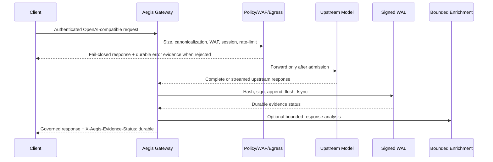

# Aegis Latent Core

**AI governance and evidence gateway for multi-provider LLM applications.**

Aegis Latent Core is an OpenAI-compatible gateway that applies request policy, WAF, egress, rate-limit, and session controls before forwarding traffic to an upstream model provider. For governed traffic, it builds a canonical evidence record, signs the record, commits it to a durable write-ahead log, and exposes the evidence status to the caller. Optional response enrichment runs behind a bounded queue and is never a substitute for the authoritative evidence commit.

> **Product boundary:** Aegis is an AI Governance and Evidence Gateway. It is not an LLM, a universal WAF, a compliance certification, a legal-admissibility ruling, a production SLO, or a replacement for network, identity, privacy, retention, or incident-response controls.

[](https://github.com/JuanLunaIA/aegis-latent-core/releases)
[](https://github.com/JuanLunaIA/aegis-latent-core/actions/workflows/ci.yml)
[](https://github.com/JuanLunaIA/aegis-latent-core/actions/workflows/security.yml)
[](LICENSE)

## Who should evaluate Aegis

Aegis is intended for platform, application-security, and AI-engineering teams operating more than one model provider or requiring provider-independent evidence for governed AI traffic. The initial commercial focus is B2B SaaS, fintech, and regulated enterprise platform teams that need private deployment and verifiable evidence but are not asking this repository to become a universal authorization or certification product.

The relevant buyer committee typically includes the CISO or AppSec owner, platform engineering, AI/ML engineering, compliance or legal, procurement, and an executive sponsor. The recommended proof sequence is **local evaluation → evidence replay → controlled pilot → security review → procurement package → production rollout**.

## The problem Aegis addresses

Standard access logs can show that an API call occurred. They do not, by themselves, establish the exact governed request and response hashes, the policy path, the evidence commit boundary, the signing scheme, the chain predecessor, or whether the request was rejected before or after the evidence boundary. Aegis makes those transitions explicit and verifiable under declared deployment controls.

## Request and evidence lifecycle



The strict lifecycle is:

1. Authenticate the caller and assign a request identifier.
2. Enforce request-size bounds and canonicalize the request representation.
3. Apply WAF, session-behavior, egress, and rate-limit controls.
4. Reject on a required-control failure instead of silently weakening the security path.
5. Forward to the configured upstream provider.
6. Capture the terminal response, compute canonical hashes, sign the evidence, append to the WAL, flush, and `fsync`.
7. Return the governed response only after the durable evidence gate. Streaming responses are buffered under the configured limit before emission.
8. Run optional response enrichment through a bounded worker path after the authoritative record exists.

## Core contract

| Control | Implemented behavior | Evidence and boundary |
|---|---|---|
| Evidence durability | The core proxy commits request/response evidence before a governed successful response and emits `X-Aegis-Evidence-Status: durable` on governed paths. | `tests/test_p0_release_gates.py`, proxy failure-path tests, WAL integrity tests. The target filesystem and storage provider still require deployment validation. |
| Durable terminal errors | Upstream non-2xx responses, circuit-open paths, and network faults use the durable error-evidence path when the evidence boundary is available. | v3.0.1 release evidence. A storage failure after admission is a fail-closed operational incident, not a successful response. |
| Chain integrity | Audit nodes bind predecessor, request hash, response hash, Merkle root, signature, and scheme metadata. | `aegis/core/crypto_audit.py` and `verify_integrity()`. Detection of tampering is not the same as immutable external storage. |
| Strong signing | Strict ledgers reject the ephemeral Ed25519 fallback. HMAC-SHA256, configured HSM, or configured native signer must be available according to policy. | Signer tests and strict startup gates. HMAC is symmetric and does not provide third-party non-repudiation. |
| Key rotation | The enterprise signer supports an atomic, versioned HMAC keyring with one active key, historical verify keys, explicit expiry, and non-secret `key_id` metadata. | `aegis_server/crypto/keyring.py`, `tests/test_keyring_rotation.py`. Three-replica deployment evidence remains required for a production claim. |
| Rate limiting | Redis-backed distributed limiting fails closed when the backend is unavailable; development in-memory limiting is not a production substitute. | Rate-limiter tests and deployment configuration. Redis/TLS/HA behavior is deployment-dependent. |
| Request bounds | Oversized bodies are rejected before normal application processing. | P0/P1 release tests. Limits must be sized for the deployed provider and streaming policy. |
| WAF | NFKC normalization, zero-width stripping, critical pattern blocks, structural depth guard, and weighted local analysis run at the application boundary. | `tests/data/waf_corpus_v1.json` and `tools/security/run_waf_corpus.py`. Ingress HTTP/2 parsing is outside the application boundary. |
| Egress | Canonical allowlists reject schemes, userinfo, malformed ports, unsupported forms, and non-approved endpoints. | `aegis/proxy/egress_guard.py` and tests. This does not replace firewall, namespace, NetworkPolicy, or cloud egress controls. |
| Kernel controls | Strict startup can require Seccomp and LSM/AppArmor/SELinux capabilities and rejects missing enforcement outside explicit sandbox mode. | `aegis/core/seccomp_guard.py`, `aegis/core/lsm_guard.py`, deployment tests. The target kernel still needs acceptance testing. |
| Response enrichment | Analysis is bounded, observable, and serialized per session where required. It is optional and cannot weaken the durable evidence contract. | Analyzer and queue tests. Queue behavior under real I/O saturation is described in the backpressure runbook. |

## Quickstart for local evaluation

The local path is for development, tests, and evidence replay. It is not a production deployment profile.

```bash
git clone https://github.com/JuanLunaIA/aegis-latent-core.git
cd aegis-latent-core
python3 -m venv .venv
. .venv/bin/activate
python -m pip install --require-hashes -r requirements.lock
python -m compileall -q aegis aegis_server
pytest -q
```

For a minimal local gateway, use the repository’s example configuration and a local or mocked upstream. Never put provider keys, bearer tokens, signing secrets, WAL records, or customer payloads into source control.

## Strict deployment path

Strict mode is the intended production posture. It requires authentication, durable evidence, strong signing, bounded request bodies, a distributed rate-limit backend, durable storage, and the configured kernel controls. Use a secret manager and mount the WAL on a durable, owner-readable path.

```bash
export AEGIS_SECURITY_ENFORCEMENT_MODE=strict
export AEGIS_API_KEYS='replace-with-a-secret-manager-reference'
export AEGIS_SIGNING_KEY='at-least-32-bytes-of-secret-material'
export AEGIS_RATE_LIMIT_BACKEND=redis
export AEGIS_REDIS_URL='rediss://redis.internal:6380/0'
export AEGIS_REQUIRE_DISTRIBUTED_LIMITER=true
export AEGIS_REQUIRE_DURABLE_EVIDENCE=true
export AEGIS_REQUIRE_LSM=true
export AEGIS_REQUIRE_SECCOMP=true
export AEGIS_MAX_REQUEST_BODY_BYTES=1048576
export AEGIS_BACKEND_URL='https://llm.internal.example/v1'
export AEGIS_WAL_PATH='/var/lib/aegis/aegis.wal.jsonl'
```

For zero-restart HMAC rotation, configure an owner-readable keyring path instead of relying on a single process-start secret:

```bash
export AEGIS_SIGNER_PROVIDER=hmac
export AEGIS_HMAC_KEYRING_PATH='/var/lib/aegis/secrets/hmac-keyring.json'
export AEGIS_HMAC_KEYRING_RELOAD_INTERVAL_S=1
```

The keyring protocol, overlap window, expiry, rollback, and three-replica acceptance criteria are in [`docs/operations/KEY_ROTATION_RUNBOOK.md`](docs/operations/KEY_ROTATION_RUNBOOK.md). A keyring path is not a secret manager; the deployment must still establish custody, access control, atomic delivery, backup, destruction, and auditability.

## Evidence and signing model

The local ledger is an append-only JSONL WAL with an in-memory bounded chain and optional archived segments. Each record contains request and response hashes, chain linkage, a Merkle root, signature metadata, and the request identifier. The WAL is flushed and synchronized before the durable response path completes.

Supported signing choices are deployment-dependent:

| Signer | Appropriate boundary | Important limitation |
|---|---|---|
| HMAC-SHA256 | Single-node or shared-secret self-hosted deployments | Symmetric key; every verifier that holds the key can also sign. HMAC is classical, not quantum-resistant. |
| HSM/Vault-backed signer | Enterprise deployments requiring key isolation or remote custody | Availability, policy, TLS/mTLS, rotation, and offline verification require the target deployment’s own evidence. |
| Native ML-DSA-65 signer | Environments that build and load the real Rust backend | The retained 1M-sample candidate artifact found no significant timing difference for `sign` (`p=0.8521504207157158`) but did not meet the threshold for `verify` (`p=0.0`); no constant-time claim is approved. See [`docs/security/PQC_CONSTANT_TIME.md`](docs/security/PQC_CONSTANT_TIME.md). |

Aegis does not fabricate ML-DSA signatures when the native backend is unavailable. It reports the backend as unavailable and requires an explicit real fallback policy. A timing result with `p > 0.05` would mean only that statistically significant leakage was not detected under the named experiment; it would not prove constant-time execution.

## Backpressure and failure semantics

Durable evidence is a hot-path invariant. Under storage or `fsync` stall, the request path may block or reject according to the configured bounds; it must not silently drop authoritative evidence. The enrichment queue may reject optional work, but a queue policy cannot turn a governed accepted response into an unrecorded response.

The deterministic fault-injection harness is:

```bash
PYTHONPATH=. .venv/bin/python tools/benchmarks/run_backpressure_stall.py \
  --duration-s 0.25 --offered-rps 10000 --fsync-delay-ms 2 --max-workers 64 \
  --output evidence/backpressure_stall_report.json
```

The current local run used 2,500 offered requests, recorded 2,500 durable commits, observed zero missing IDs, zero duplicate IDs, and valid chain integrity under a 2 ms injected `fsync` delay. That is a bounded fault-injection result. It is not a 10k requests-per-second production capacity claim. See [`docs/operations/BACKPRESSURE_RUNBOOK.md`](docs/operations/BACKPRESSURE_RUNBOOK.md).

## WAF and ingress boundary

The local corpus currently covers 15 executable malicious cases and 8 benign cases. The v3.1.0 candidate run recorded zero observed bypasses and zero benign false positives for that pinned corpus. Because the corpus is small, its confidence interval is wide; the result is a regression signal, not universal detection coverage.

The application harness does not execute HTTP/2 fragmentation, pseudo-header ordering, continuation-boundary differentials, compressed-body parser differences, or ingress-specific normalization. `nuclei-templates/waf-bypass` is not treated as executed unless a pinned revision runs against an authorized disposable local target and produces a retained artifact. See [`docs/security/WAF_TESTING.md`](docs/security/WAF_TESTING.md).

## Observability and operations

Governed responses expose `X-Aegis-Request-ID`, `X-Aegis-Session-ID`, `X-Aegis-Evidence-Status`, `X-Aegis-Analysis-Status`, and the preliminary `X-Aegis-Alert-Count` where applicable. The alert count is preliminary when enrichment runs after the durable commit; authoritative records are in the evidence/enrichment store.

Operators should alert on evidence-commit failures, WAL synchronization failures, rate-limit backend failures, queue saturation, circuit opening, upstream error spikes, keyring reload failures, missing key overlap, signer unavailability, Seccomp/LSM startup rejection, and integrity-verification failure. Preserve WAL segments and reports read-only during incident handling. Roll back to the prior signed/image-digest release when a kill criterion is met.

## Deployment topologies

| Topology | Use | Evidence boundary | Open risk |
|---|---|---|---|
| Single process / single durable WAL | Local evaluation and small self-hosted deployments | One process owns the chain and storage path | Process, volume, and key custody are single failure domains. |
| One worker per pod | Horizontal application scaling with independent local bundles | Each pod produces an independently verifiable bundle | Cross-replica global ordering is not implied. |
| Three replicas with shared key control | Rotation and failover exercise | Each node includes key ID and can verify overlap material | Secret-manager propagation, clock, storage, and replica orchestration require acceptance evidence. |
| Centralized writer | Ordered evidence across stateless gateway replicas | A single writer or approved ordering service owns the durable sequence | Writer availability, queue behavior, and cross-region failure modes remain architecture work. |

Cross-replica global audit ordering and multi-region HA are not claimed by the current release. Use the scaling guide and roadmap as the authoritative boundary.

## Benchmark interpretation

The repository separates dispatch microbenchmarks, client-visible proxy overhead, upstream-inclusive latency, WAL durability throughput, WAF corpus metrics, and native crypto timing. Each measurement must identify workload, hardware, warmup, sample count, percentile method, raw artifact, and boundary.

The previously published 2.70 µs result is a background-dispatch microbenchmark, not end-to-end gateway latency. Per-worker throughput is constrained by the interpreter, event-loop scheduling, upstream behavior, storage, and deployment topology. No README claim of “zero latency,” “zero overhead,” “10k RPS capacity,” or “1B RPM” is authorized without a new artifact that satisfies the claim matrix.

See [`docs/benchmarks/README.md`](docs/benchmarks/README.md), [`docs/BENCHMARKS.md`](docs/BENCHMARKS.md), and [`docs/performance/SCALING_GUIDE.md`](docs/performance/SCALING_GUIDE.md).

## Security and supply-chain posture

The release process produces a lockfile, SBOM, dependency/advisory results, provenance envelope, release-gate record, repository manifest, asset hashes, and rollback instructions. The security policy is in [`SECURITY.md`](SECURITY.md); the public claim controls are in [`docs/CLAIMS_MATRIX.md`](docs/CLAIMS_MATRIX.md). Vulnerability reports should use the private reporting path described in `SECURITY.md`, not public issue comments.

The repository does not claim SOC 2, HIPAA, FedRAMP, EU AI Act conformity, GDPR compliance, FIPS 140 validation, or court admissibility by itself. It provides code and evidence paths that an organization may evaluate as part of a broader control system and independent assessment.

## Commercial path

The commercial model is intentionally staged:

| Package | Scope | Promise boundary |
|---|---|---|
| Community / OSS | AGPL self-hosted evaluation and open-source use | No support or SLA promise. |
| Team / Pilot | Time-bounded, production-like evaluation with a named scope | Fixed scope, evidence replay, deployment checklist, and explicit support hours. |
| Production | Commercial self-hosted deployment, updates, and deployment guidance | Annual commercial terms sized by deployment and request tier; no unsupported certification promise. |
| Enterprise | Procurement, architecture assistance, security review, and negotiated response targets | Requires an accountable support operation, legal terms, data-retention statement, and explicit exclusions. |
| Sovereign / OEM | Air-gapped, redistribution, embedded, escrow, or dedicated assurance | Future offer only after capacity, legal review, and independent assurance exist. |

Pricing hypotheses, cost-to-serve assumptions, procurement blockers, and buyer questions are in [`docs/COMMERCIAL_STRATEGY_US.md`](docs/COMMERCIAL_STRATEGY_US.md) and [`docs/BUYER_GUIDE_US.md`](docs/BUYER_GUIDE_US.md). The repository does not fabricate customer logos, testimonials, adoption numbers, support coverage, or ROI guarantees.

## Repository map

| Path | Purpose |
|---|---|
| `aegis/proxy/app.py` | Core FastAPI proxy lifecycle, request controls, evidence gate, streaming policy, headers, and bounded enrichment. |
| `aegis/proxy/waf.py` | Application-layer WAF and normalization pipeline. |
| `aegis/proxy/egress_guard.py` | Canonical egress allowlist and endpoint validation. |
| `aegis/core/crypto_audit.py` | Canonical forensic ledger, signatures, WAL persistence, rotation, and integrity verification. |
| `aegis/core/ratelimiter.py` | In-memory development limiter and fail-closed Redis limiter. |
| `aegis/core/seccomp_guard.py` | Seccomp capability and enforcement guard. |
| `aegis/core/lsm_guard.py` | AppArmor/SELinux detection and strict assertion. |
| `aegis_server/crypto/keyring.py` | Versioned HMAC keyring with atomic reload and overlap verification. |
| `aegis_server/` | Enterprise persistence and compliance API lifecycle. |
| `tests/test_p0_release_gates.py` | Blocking P0/P1 regression tests from the v3.0.1 release. |
| `tests/test_market_hardening_gates.py` | New WAF and fsync fault-injection regression gates. |
| `tools/benchmarks/run_backpressure_stall.py` | Reproducible local WAL-stall benchmark. |
| `tools/security/run_waf_corpus.py` | Reproducible local WAF corpus harness. |
| `tools/benchmarks/run_key_rotation.py` | Local multi-instance atomic key rotation exercise. |
| `tools/benchmarks/run_pqc_timing.py` | Native ML-DSA timing harness with raw-sample retention. |
| `docs/CLAIMS_MATRIX.md` | Public claim status, evidence locator, and falsification boundary. |
| `docs/architecture/` | Architecture index and decision records. |
| `docs/operations/` | Backpressure, rotation, rollback, and operational runbooks. |
| `docs/security/` | Threat model, WAF testing, PQC assessment, and assurance roadmap. |
| `docs/benchmarks/` | Measurement contract and interpretation rules. |
| `requirements.lock` | Hash-checked dependency resolution. |

## Documentation index

| Audience | Start here |
|---|---|
| Developer | [`docs/REPOSITORY_MAP.md`](docs/REPOSITORY_MAP.md), [`CONTRIBUTING.md`](CONTRIBUTING.md), and the quickstart above. |
| Operator | [`DEPLOYMENT_GUIDE.md`](DEPLOYMENT_GUIDE.md), [`docs/operations/BACKPRESSURE_RUNBOOK.md`](docs/operations/BACKPRESSURE_RUNBOOK.md), and [`docs/operations/KEY_ROTATION_RUNBOOK.md`](docs/operations/KEY_ROTATION_RUNBOOK.md). |
| Security reviewer | [`SECURITY.md`](SECURITY.md), [`docs/security/THREAT_MODEL.md`](docs/security/THREAT_MODEL.md), and [`docs/CLAIMS_MATRIX.md`](docs/CLAIMS_MATRIX.md). |
| Buyer and procurement | [`docs/PRODUCT_BRIEF_US.md`](docs/PRODUCT_BRIEF_US.md), [`docs/BUYER_GUIDE_US.md`](docs/BUYER_GUIDE_US.md), and [`docs/COMMERCIAL_STRATEGY_US.md`](docs/COMMERCIAL_STRATEGY_US.md). |
| Release owner | [`CHANGELOG.md`](CHANGELOG.md), [`docs/benchmarks/README.md`](docs/benchmarks/README.md), release artifacts, and the gate record. |

## Non-goals and residual risk

Application-layer controls do not replace network segmentation, firewall policy, Kubernetes NetworkPolicy, cloud IAM, a secret manager, immutable backup, disaster-recovery testing, or an incident-response program. Strict startup checks prove configured prerequisites at initialization; they do not prove that an external provider, filesystem, kernel, signer, or network remains healthy indefinitely. HMAC-SHA256 is classical and symmetric; long-lived or quantum-sensitive evidence requires a reviewed migration or hybrid architecture. ML-DSA availability is not equivalent to constant-time proof, FIPS 140 validation, or certification.

A release is blocked when a governed accepted response lacks durable evidence in the declared test scope, a chain fails verification, a critical WAF corpus case bypasses, a valid key rotation loses or invalidates a record, a timing experiment exposes leakage, a supply-chain gate fails, or public documentation overstates the evidence. See [`docs/SECURITY_ASSURANCE_ROADMAP.md`](docs/SECURITY_ASSURANCE_ROADMAP.md) for the external-assurance path.

## License

The repository is licensed under the terms in [`LICENSE`](LICENSE) and [`COMMERCIAL.md`](COMMERCIAL.md). Commercial use cases, AGPL obligations, exemptions, future-version rights, and contractual terms require the applicable license text and legal review; this README is not legal advice.

## Current release

The immutable published baseline is [`v3.0.1`](https://github.com/JuanLunaIA/aegis-latent-core/releases/tag/v3.0.1). The current market-hardening line is `3.1.0` candidate work; it remains unreleased until source, tests, supply-chain artifacts, GitHub checks, PQC residual-risk review, human review, and release provenance pass together.
