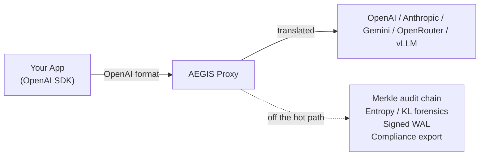
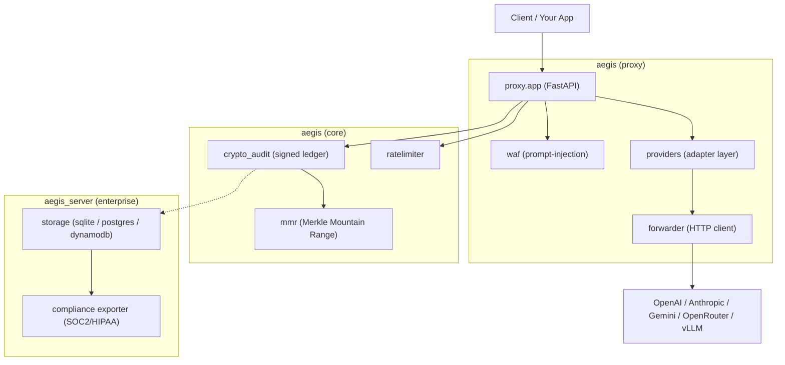

<div align="center">

<br/>

# Aegis Latent Core


### The inference governance layer for production LLM deployments.

**Drop-in OpenAI-compatible proxy · Multi-provider (OpenAI · Anthropic · Gemini · OpenRouter) · Cryptographic Merkle audit chain · Entropy/KL forensics · SOC2 / HIPAA compliance exports · Zero application changes**

<br/>

[](https://github.com/JuanLunaIA/aegis-latent-core/actions/workflows/ci.yml)
[](COMMERCIAL.md)
[](https://www.python.org/)
[](CHANGELOG.md)

<br/>

</div>

---

## The problem

If you run an LLM in production — especially under SOC2, HIPAA, or any regulated
workload — you need to answer two questions at any later date:

1. **"What exactly did the model receive and return on request X?"**
2. **"Can you *prove* that record wasn't altered after the fact?"**

Application logs answer neither: they are mutable, unsigned, and trivially
reordered. Aegis sits between your app and any LLM provider and turns every
request/response into a **cryptographically linked, tamper-evident audit node** —
without changing your application and without adding I/O latency to the user.



---

## How it works

| Step | What happens | On the request hot path? |
|---|---|---|
| 1 | Auth (constant-time key check) | yes |
| 2 | WAF: hard-block critical injection patterns + weighted scoring | yes |
| 3 | Rate limit (token bucket; memory or Redis) | yes |
| 4 | Provider adapter translates request → upstream format | yes |
| 5 | Forward to upstream LLM; translate response back to OpenAI format | yes |
| 6 | **Return response to client** | — |
| 7 | Entropy/KL analysis + sign + append Merkle node + WAL write | **no — scheduled after the return** |

Step 7 runs in a background task created *after* the response is returned, so the
audit commit adds **no I/O wait** to the client. The only cost on the hot path is
the scheduling call itself — measured at **77 µs p50 / 132 µs p99** in our
environment ([BENCHMARKS.md](docs/BENCHMARKS.md)).

---

## Quick start (< 5 minutes)

### 0. See it work end-to-end first (no provider key needed)

The fastest way to evaluate Aegis: a self-contained demo that boots the proxy
against an in-process mock upstream, sends requests, shows the audit chain
growing, verifies integrity, demonstrates tamper-detection, and exports a sealed
compliance bundle — all in one command.

```bash
git clone https://github.com/JuanLunaIA/aegis-latent-core
cd aegis-latent-core
pip install -e ".[storage-sqlite]"
python -m examples.demo
```

Expected: `RESULTADO: 5/5 verificaciones OK — demo exitosa.` (exit code 0).
See [`examples/README.md`](examples/README.md) for what each step proves.

### 1. Run it against a real provider

```bash
cp .env.example .env
# Edit .env: set AEGIS_PROVIDER, AEGIS_BACKEND_API_KEY, AEGIS_API_KEYS,
# and a dedicated AEGIS_SIGNING_KEY (see below).
uvicorn aegis.proxy.app:create_proxy_app --factory --port 8080
```

Point your existing OpenAI SDK at the proxy — nothing else changes:

```python
from openai import OpenAI

client = OpenAI(base_url="http://localhost:8080/v1", api_key="your-proxy-key")
resp = client.chat.completions.create(
    model="gpt-4o",
    messages=[{"role": "user", "content": "Hello!"}],
)
```

### 2. Verify the audit chain

```bash
curl -H "Authorization: Bearer your-audit-key" \
     http://localhost:8080/v1/audit/integrity
# → {"valid": true, "node_count": N, ...}
```

### Generate a signing key

```bash
python -c 'import secrets; print(secrets.token_hex(32))'
```

> An empty `AEGIS_SIGNING_KEY` makes audit nodes fall back to ephemeral Ed25519,
> which downgrades `legal_admissibility` to `"Compromised"`. Always set a
> dedicated key in production — see [SECURITY.md](SECURITY.md).

---

## Multi-provider support

Switch the upstream with one environment variable. Your app always speaks
OpenAI format; Aegis translates transparently.

| Provider | `AEGIS_PROVIDER=` | Auth | Streaming | Logprobs for entropy |
|---|---|---|---|---|
| OpenAI | `openai` | `Authorization: Bearer` | ✅ passthrough | ✅ token-level |
| Anthropic Claude | `anthropic` | `x-api-key` | ✅ translated (SSE) | ❌ char-level fallback |
| Google Gemini | `gemini` | `Authorization: Bearer` | ✅ translated | ❌ char-level fallback |
| OpenRouter | `openrouter` | `Authorization: Bearer` | ✅ passthrough | ✅ token-level |
| Any OpenAI-compat (vLLM, Ollama, LM Studio) | `openai` | `Authorization: Bearer` | ✅ passthrough | ✅ token-level |

> Anthropic and Gemini APIs do **not** expose token logprobs, so entropy
> forensics fall back to character-level analysis for those providers
> ([claim L1](docs/audit/CLAIMS_VERIFICATION.md)).

```env
# Anthropic
AEGIS_PROVIDER=anthropic
AEGIS_BACKEND_API_KEY=sk-ant-your-key
AEGIS_PROVIDER_MODEL=claude-opus-4-5

# OpenRouter (300+ models behind one key)
AEGIS_PROVIDER=openrouter
AEGIS_BACKEND_API_KEY=sk-or-your-key
AEGIS_PROVIDER_MODEL=meta-llama/llama-3.1-70b-instruct

# Local / self-hosted
AEGIS_PROVIDER=openai
AEGIS_BACKEND_URL=http://localhost:11434   # Ollama
AEGIS_PROVIDER_MODEL=llama3.2:3b
```

---

## Architecture



An audit node (HMAC path):

```json
{
  "node_hash": "sha256(prev_hash || state_id || ts || ... || signature || ...)",
  "prev_hash": "sha256(...previous node...)",
  "merkle_root": "mmr.add_leaf(request_hash || response_hash)",
  "signature": "hmac_sha256(AEGIS_SIGNING_KEY, prev_hash|root|req|resp)",
  "signature_scheme": "hmac-sha256",
  "entropy": 3.142,
  "model": "claude-opus-4-5"
}
```

`prev_hash` is the **first** hashed field of `node_hash`, so reordering nodes in
storage breaks the chain and is caught by `verify_integrity()` — the property
that makes the chain tamper-*evident*, not just append-only.

For the full request trace, lock map, and trust boundaries, see
[`docs/audit/STATE.md`](docs/audit/STATE.md). For deployment, see
[`DEPLOYMENT_GUIDE.md`](DEPLOYMENT_GUIDE.md).

---

## Claims, with evidence

Every claim below links to code, an audit document, or a measured benchmark.
The authoritative matrix is
[`docs/audit/CLAIMS_VERIFICATION.md`](docs/audit/CLAIMS_VERIFICATION.md).

| Claim | Status | Evidence |
|---|---|---|
| Tamper-evident audit chain | **Proven** | reorder attack caught by `tests/test_security_fixes.py`; [SECURITY_AUDIT.md §2](docs/audit/SECURITY_AUDIT.md) |
| No chain fork under concurrency | **Proven** | 100×50 concurrency burst test; [SECURITY_AUDIT.md §1,§3](docs/audit/SECURITY_AUDIT.md) |
| SSE commit survives disconnect | **Proven** | [SECURITY_AUDIT.md §4](docs/audit/SECURITY_AUDIT.md) |
| SOC2/HIPAA sealed, re-verifiable export | **Proven** | `examples/demo.py` step 5; `aegis_server/compliance/exporter.py` |
| "Zero forensic latency" (no client I/O wait) | **Proven** | commit runs after the response return |
| Hot-path scheduling overhead | **Measured: 77 µs p50 / 132 µs p99** | [BENCHMARKS.md](docs/BENCHMARKS.md) |
| Rust extension builds & runs | **Verified** | `maturin build --release` clean; 23/23 Rust unit tests; PQC `ml-dsa` signing, async forwarder & Aho-Corasick WAF exercised end-to-end |
| Rust MMR speedup | **Measured: ~1.35× avg (max 1.38×)** | `python -m benchmarks.bench_mmr`; modest — PyO3 marshalling dominates at small N |
| Anthropic/Gemini token-level entropy | **Partial** | char-level fallback; [CLAIMS_VERIFICATION.md L1](docs/audit/CLAIMS_VERIFICATION.md) |
| mTLS upstream identity assertion | **Partial** | certs applied, identity not asserted per-request; [L2](docs/audit/CLAIMS_VERIFICATION.md) |

The Rust extension compiles cleanly and is functionally verified (PQC signing,
async connection-pooled forwarder, and SIMD WAF all exercised end-to-end). The
**MMR** speedup is a measured but modest **~1.35×** — PyO3 call-marshalling
dominates for small batches, so the native MMR is not the headline win. The
async forwarder's throughput advantage (connection pooling + HTTP/2) is the
larger benefit on the request path; reproduce both with
`python -m benchmarks.bench_mmr` and `python -m benchmarks.bench_forwarding`.

---

## Compliance export

```bash
curl -X POST http://localhost:8080/v1/enterprise/compliance/export \
  -H "Authorization: Bearer your-audit-key" \
  -H "Content-Type: application/json" \
  -d '{"format": "soc2", "start_ts": "2026-01-01T00:00:00Z", "end_ts": "2026-12-31T23:59:59Z"}'
```

Produces a UTF-8 JSON bundle sealed with a SHA-256 `chain_hash` and a
`bundle_signature` over it (HMAC-SHA256 or Vault Transit). An external auditor
re-verifies it independently with `ComplianceExporter.verify_bundle()` — no
access to your running system required. The `examples/demo.py` script exercises
this exact path (write nodes → seal bundle → re-verify signature & hash).

---

## Optional: Rust extension

Building the PyO3 extension swaps in a native MMR/forwarder/PQC implementation.
The Python path remains the verified reference and proof generator.

```bash
python -m pip install maturin patchelf
cd aegis_rust_v2 && maturin develop --release && cd -
python -m benchmarks.bench_mmr   # Rust-vs-Python MMR speedup (~1.35× here)
```

> Verified to build cleanly and pass all 23 Rust unit tests; the extension is
> auto-detected at import (`aegis.core.rust_integration.has_rust()`), with a
> transparent pure-Python fallback when it is absent. The measured MMR speedup
> is a modest **~1.35×**; the async forwarder is the larger request-path win.
> See [docs/RUST_BUILD.md](docs/RUST_BUILD.md).

---

## Development

```bash
pip install -e ".[storage-sqlite,dev]"

pytest tests/ --override-ini="addopts=" -q   # test suite
ruff check aegis/ aegis_server/              # lint
mypy aegis/ aegis_server/                    # type check
python -m examples.demo                      # end-to-end smoke

# Forensics visualizer (LOCAL DEV TOOL ONLY — never expose publicly)
cd tools/visualizer && pip install -r requirements.txt
python -m uvicorn app:app --host 127.0.0.1 --port 8888
```

---

## Docker

```bash
docker build -t aegis-latent-core:2.4.0 .
docker run -p 8080:8080 \
  -e AEGIS_PROVIDER=anthropic \
  -e AEGIS_BACKEND_API_KEY=sk-ant-xxx \
  -e AEGIS_API_KEYS=your-proxy-key \
  -e AEGIS_SIGNING_KEY=$(python -c 'import secrets; print(secrets.token_hex(32))') \
  aegis-latent-core:2.4.0
```

---

## Documentation

| Document | What it covers |
|---|---|
| [examples/README.md](examples/README.md) | The reproducible end-to-end demo |
| [docs/BENCHMARKS.md](docs/BENCHMARKS.md) | Measured latency & throughput, reproduce commands |
| [docs/audit/CLAIMS_VERIFICATION.md](docs/audit/CLAIMS_VERIFICATION.md) | Every claim ↔ its evidence |
| [docs/audit/STATE.md](docs/audit/STATE.md) | Full code audit: lifecycle, locks, trust boundaries |
| [docs/audit/SECURITY_AUDIT.md](docs/audit/SECURITY_AUDIT.md) | Audit-chain security verification & fixes |
| [DEPLOYMENT_GUIDE.md](DEPLOYMENT_GUIDE.md) | Production deployment & threat model |
| [SECURITY.md](SECURITY.md) | Hardening checklist & vulnerability reporting |
| [CHANGELOG.md](CHANGELOG.md) | Release history |

---

## License

[AGPLv3](LICENSE) for open-source use · Commercial license available for
proprietary deployments ([COMMERCIAL.md](COMMERCIAL.md)).
Vulnerability reporting & deployment hardening: [SECURITY.md](SECURITY.md).
