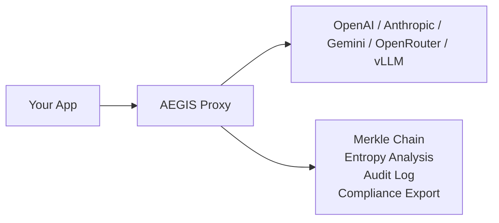
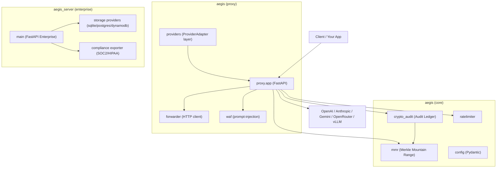
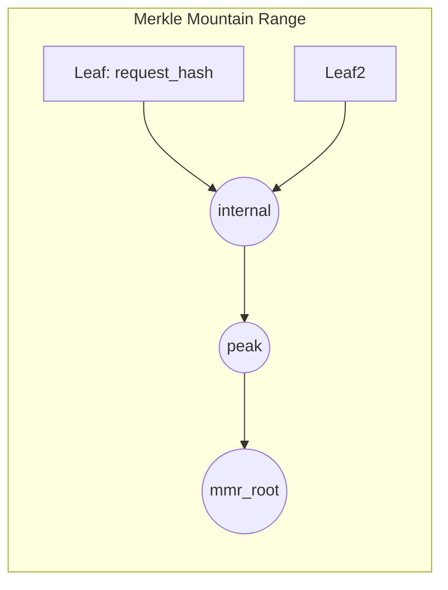
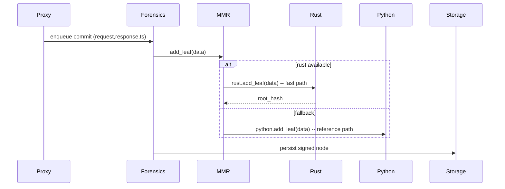

<div align="center">

<br/>

# Aegis Latent Core


### The open-source inference governance layer every production LLM deployment needs.

**Drop-in OpenAI-compatible proxy · Multi-provider (OpenAI · Anthropic · Gemini · OpenRouter) · Cryptographic Merkle audit chain · Real-time entropy forensics · SOC2 / HIPAA compliance exports · Zero infrastructure changes**

<br/>

[](https://github.com/JuanLunaIA/aegis-latent-core/actions/workflows/ci.yml)
[](COMMERCIAL.md)
[](https://www.python.org/)
<<<<<<< HEAD
[](CHANGELOG.md)
=======
[](CHANGELOG.md)
>>>>>>> c11319c9d5522df98ed3727694afe7eacd82bee0
[](https://fastapi.tiangolo.com/)
[](tests/)

<br/>

</div>

---

## What is Aegis?

Aegis sits between your application and any LLM provider. It intercepts every request and response to build a **cryptographically verifiable, tamper-evident audit chain** — without adding latency to your users.




One `AEGIS_PROVIDER=` line in your `.env` switches the upstream. Your application code doesn't change.

---

## Quick Start

```bash
git clone https://github.com/JuanLunaIA/aegis-latent-core
cd aegis-latent-core
pip install -e ".[storage-sqlite]"
cp .env.example .env
# Edit .env — set AEGIS_PROVIDER and AEGIS_BACKEND_API_KEY
uvicorn aegis.proxy.app:create_proxy_app --factory --port 8080
```

Point your OpenAI SDK at `http://localhost:8080` and you're done:

```python
from openai import OpenAI
client = OpenAI(base_url="http://localhost:8080/v1", api_key="your-proxy-key")
response = client.chat.completions.create(
    model="gpt-4o",
    messages=[{"role": "user", "content": "Hello!"}],
)
```

### Optional: Build & enable Rust extension (recommended for high throughput)

Building the Rust PyO3 extension (aegis_rust) yields significant performance gains for forwarding, MMR and PQC operations:

```bash
# From repo root
python -m pip install maturin
cd aegis_rust_v2 && maturin develop --release && cd -
```

After successful build, `import aegis_rust` will return the optimized module used by the proxy (Rust-forwarder, MMR and PQC are exposed). If building is not possible, the Python fallback remains fully functional.

Note: when the Rust extension is installed, the Merkle Mountain Range (MMR) operations and PQC functions automatically use the Rust implementation for significantly higher throughput; the Python implementation is retained as a verified fallback for proofs and verification.

---

<<<<<<< HEAD
## Multi-Provider Support

Aegis ships a provider adapter layer that lets you switch upstreams with a single environment variable. Your application sends standard OpenAI-format requests and receives OpenAI-format responses regardless of the backend.
=======
## Multi-Provider Support (v2.2.0)

Aegis v2.2.0 adds a provider adapter layer. Switch providers with a single environment variable — your application sends standard OpenAI-format requests and receives OpenAI-format responses regardless of the backend.
>>>>>>> c11319c9d5522df98ed3727694afe7eacd82bee0

### Supported Providers

| Provider | `AEGIS_PROVIDER=` | Auth | Streaming | Logprobs |
|---|---|---|---|---|
| OpenAI | `openai` | `Authorization: Bearer` | ✅ passthrough | ✅ |
| Anthropic Claude | `anthropic` | `x-api-key` | ✅ translated | ❌ (char entropy fallback) |
| Google Gemini | `gemini` | `Authorization: Bearer` | ✅ passthrough | ✅ partial |
| OpenRouter | `openrouter` | `Authorization: Bearer` | ✅ passthrough | ✅ |
| Any OpenAI-compat | `openai` | `Authorization: Bearer` | ✅ passthrough | ✅ |

### Configuration Examples

**OpenAI (default)**
```env
AEGIS_PROVIDER=openai
AEGIS_BACKEND_API_KEY=sk-your-openai-key
```

**Anthropic Claude**
```env
AEGIS_PROVIDER=anthropic
AEGIS_BACKEND_API_KEY=sk-ant-your-anthropic-key
# Optional: pin the upstream model
AEGIS_PROVIDER_MODEL=claude-opus-4-5
```

**Google Gemini**
```env
AEGIS_PROVIDER=gemini
AEGIS_BACKEND_API_KEY=your-gemini-api-key
AEGIS_PROVIDER_MODEL=gemini-2.0-flash
```

**OpenRouter** — 300+ models behind one key
```env
AEGIS_PROVIDER=openrouter
AEGIS_BACKEND_API_KEY=sk-or-your-openrouter-key
AEGIS_OPENROUTER_SITE_URL=https://yourapp.com
AEGIS_OPENROUTER_SITE_NAME=YourApp
# Route to any OpenRouter model:
AEGIS_PROVIDER_MODEL=meta-llama/llama-3.1-70b-instruct
```

**Local / self-hosted (vLLM, Ollama, LM Studio)**
```env
AEGIS_PROVIDER=openai
AEGIS_BACKEND_URL=http://localhost:11434   # Ollama
AEGIS_BACKEND_API_KEY=                    # empty for local
AEGIS_PROVIDER_MODEL=llama3.2:3b
```

### How Translation Works (Anthropic)

Aegis translates transparently — your app always sends/receives OpenAI format:

```
Client (OpenAI format)                Aegis                 Anthropic API
─────────────────────────────────────────────────────────────────────────
POST /v1/chat/completions   ──►   translate_request   ──►   POST /v1/messages
  {"model": "claude-opus-4-5",          │                     {"model": "...",
   "messages": [                         │                      "system": "...",
     {"role": "system", ...},            │                      "messages": [...],
     {"role": "user", ...}               │                      "max_tokens": 4096}
   ]}                                    │
                                         │
{"choices": [{"message":        ◄──   translate_response  ◄──  {"content": [...],
  {"role": "assistant",                  │                       "stop_reason": ...}
   "content": "..."}}]}                  │

# Streaming: Anthropic SSE events → OpenAI chunks (transparent)
data: {"type":"content_block_delta"} → data: {"choices":[{"delta":{"content":"..."}}]}
```

---

## Installation

### Minimal (SQLite storage, single-provider)
```bash
pip install "aegis-latent-core[storage-sqlite]"
```

### With specific storage backends
```bash
pip install "aegis-latent-core[storage-sqlite]"    # SQLite (default, zero config)
pip install "aegis-latent-core[storage-postgres]"  # PostgreSQL
pip install "aegis-latent-core[storage-dynamodb]"  # AWS DynamoDB
pip install "aegis-latent-core[storage-all]"       # All backends
```

### With optional features
```bash
pip install "aegis-latent-core[storage-sqlite,vault,metrics]"
# vault   = HashiCorp Vault Transit signing
# metrics = Prometheus /metrics endpoint
# pqc     = Post-quantum CRYSTALS-Dilithium signatures
```

### Development
```bash
pip install "aegis-latent-core[storage-sqlite,dev]"
```

---

## Configuration Reference

All settings are environment variables (or `.env` file). See `.env.example` for a full annotated template.

### Core Settings

| Variable | Default | Description |
|---|---|---|
| `AEGIS_PROVIDER` | `openai` | Provider adapter: `openai`, `anthropic`, `gemini`, `openrouter` |
| `AEGIS_PROVIDER_MODEL` | `""` | Override upstream model name (optional) |
| `AEGIS_BACKEND_URL` | `http://localhost:11434` | Upstream URL (ignored for providers with fixed base URL) |
| `AEGIS_BACKEND_API_KEY` | `""` | API key for the upstream provider |
| `AEGIS_API_KEYS` | `""` | Comma-separated keys for proxy client auth |
| `AEGIS_SIGNING_KEY` | `""` | **Dedicated** HMAC-SHA256 key for Merkle chain signing |
| `AEGIS_DEBUG_MODE` | `false` | Enables `/docs`, `/redoc` (local dev only) |
| `AEGIS_FORCE_LOGPROBS` | `false` | Inject `logprobs=true` into requests (OpenAI-compat only) |
| `AEGIS_HOST` | `0.0.0.0` | Bind address |
| `AEGIS_PORT` | `8080` | Listen port |

### Provider-Specific Settings

| Variable | Provider | Description |
|---|---|---|
| `AEGIS_OPENROUTER_SITE_URL` | openrouter | HTTP-Referer for OpenRouter analytics |
| `AEGIS_OPENROUTER_SITE_NAME` | openrouter | X-Title for OpenRouter analytics |
| `AEGIS_ANTHROPIC_API_VERSION` | anthropic | `anthropic-version` header (default: `2023-06-01`) |

### Generate a Signing Key

```bash
python -c 'import secrets; print(secrets.token_hex(32))'
# → 7f3a9b2c1d4e5f6a7b8c9d0e1f2a3b4c5d6e7f8a9b0c1d2e3f4a5b6c7d8e9f0a
```

---

## Architecture




### Request Lifecycle

```
1. Client sends OpenAI-format POST /v1/chat/completions
2. WAF inspects payload for prompt injection patterns
3. Rate limiter checks session quota (token bucket, TTL-evicted)
4. Provider adapter translates request to upstream format
5. Forwarder sends to upstream LLM (OpenAI / Anthropic / Gemini / OpenRouter)
6. Provider adapter translates response back to OpenAI format
7. Response returned to client immediately — ZERO forensic latency
8. BackgroundTask runs off-path:
   a. Parse response, extract logprobs (or fall back to char entropy)
   b. Compute position-averaged Shannon entropy H = (1/T) Σ -Σ p_{t,k} log₂ p_{t,k}
   c. get_latest_node() for correct prev_hash (chain_lock held)
   d. MerkleMountainRange.add_leaf(request_hash || response_hash || ts)
   e. Sign merkle_root via HMAC-SHA256 with AEGIS_SIGNING_KEY
   f. write_node() under chain_lock — prevents concurrent chain forks
```

---

## Audit Chain

Every request produces a cryptographically linked audit node:

```json
{
  "node_id": "sha256(merkle_root || signature)",
  "prev_hash": "sha256(...previous node...)",
  "merkle_root": "mmr.add_leaf(request_hash || response_hash || timestamp)",
  "signature": "hmac_sha256(AEGIS_SIGNING_KEY, merkle_root)",
  "entropy": 3.142,
  "model": "claude-opus-4-5",
  "usage": {"prompt_tokens": 150, "completion_tokens": 42}
}
```

The chain is verified with:
```bash
curl http://localhost:8080/v1/audit/integrity
```

---

## Entropy Forensics

Aegis computes **position-averaged Shannon entropy** for every response:

```
H = (1/T) × Σ_{t=1}^{T} [ -Σ_{k=1}^{K} p_{t,k} × log₂(p_{t,k}) ]
```

Where `p_{t,k}` = softmax of top-K token logprobs at position `t`.

- High entropy (> threshold) → model is uncertain, potentially hallucinating
- Low entropy → model is confident
- For Anthropic/Gemini (no logprobs): falls back to character-level entropy

Configure the alert threshold with `AEGIS_ENTROPY_ALERT_THRESHOLD_BITS`.

---

## Compliance Export

```bash
curl -X POST http://localhost:8080/v1/enterprise/compliance/export \
  -H "Authorization: Bearer your-audit-key" \
  -H "Content-Type: application/json" \
  -d '{"format": "soc2", "start_ts": "2026-01-01T00:00:00Z", "end_ts": "2026-12-31T23:59:59Z"}'
```

Produces a sealed, SHA-256-hashed bundle with full chain-of-custody.

---

## Development

```bash
# Install dev dependencies
pip install -e ".[storage-sqlite,dev]"

# Run tests
pytest tests/ --override-ini="addopts=" -v

# Run only provider tests
pytest tests/test_providers.py -v --override-ini="addopts="

# Lint
ruff check aegis/ aegis_server/

# Type check
mypy aegis/ aegis_server/
<<<<<<< HEAD

# Optional: build Rust extension (significant throughput improvement)
python -m pip install maturin
cd aegis_rust_v2 && maturin develop --release && cd -
=======
>>>>>>> c11319c9d5522df98ed3727694afe7eacd82bee0
```

---

<<<<<<< HEAD
## Tools: Forensics Visualizer

`tools/visualizer/` ships a local dashboard for inspecting the repository state and audit chain without standing up a full deployment.

```bash
cd tools/visualizer
pip install -r requirements.txt
python -m uvicorn app:app --host 127.0.0.1 --port 8888
# Open http://127.0.0.1:8888
```

The dashboard (`tools/visualizer/static/index.html`) shows:

- **Git HEAD** and Python / Rust file count
- **Pytest telemetry** — pass/fail count pulled from the last run
- **Rust extension build status** — maturin compilation result
- **System Visualization** — Architecture and lifecycle Mermaid diagrams (tabbed)
- **Audit Ledger Node Layout** — JSON schema of a signed chain node
- **Static Security Forensics Scan** — pattern matches for credentials, excessive privileges, and potential vulnerabilities pulled from `/api/forensic_report`

The visualizer is a **local development tool only**. Never expose it to public networks.

=======
## Development (extended)

Below is an opinionated dev setup and quick verification steps (Rust + Python):

```bash
# Create virtualenv + install dev deps
python -m venv .venv && source .venv/bin/activate
pip install -U pip
pip install -e ".[storage-sqlite,dev]"

# Build Rust extension
python -m pip install maturin
cd aegis_rust_v2 && maturin develop --release && cd -

# Short verifications
cargo test --manifest-path aegis_rust_v2/Cargo.toml --lib --quiet || true
pytest tests/test_providers.py -q -k "not slow" --maxfail=1 || true
```

>>>>>>> c11319c9d5522df98ed3727694afe7eacd82bee0
---

## Docker

```bash
# Build
<<<<<<< HEAD
docker build -t aegis-latent-core:2.3.0 .
=======
docker build -t aegis-latent-core:2.2.0 .
>>>>>>> c11319c9d5522df98ed3727694afe7eacd82bee0

# Run with Anthropic
docker run -p 8080:8080 \
  -e AEGIS_PROVIDER=anthropic \
  -e AEGIS_BACKEND_API_KEY=sk-ant-xxx \
  -e AEGIS_API_KEYS=your-proxy-key \
  -e AEGIS_SIGNING_KEY=$(python -c 'import secrets; print(secrets.token_hex(32))') \
<<<<<<< HEAD
  aegis-latent-core:2.3.0
=======
  aegis-latent-core:2.2.0
>>>>>>> c11319c9d5522df98ed3727694afe7eacd82bee0
```

---

## Changelog

See [CHANGELOG.md](CHANGELOG.md) for the full history.

<<<<<<< HEAD
**v2.3.0** (2026-06-04) — Operational hardening: 3 blocker fixes (LSM guard crash, ResponseAnalyzer threshold decoupling, mTLS never wired), explicit 401/403 upstream logging, deep `/health` and `/ready` endpoints, Forensics Visualizer tool.

=======
>>>>>>> c11319c9d5522df98ed3727694afe7eacd82bee0
**v2.2.0** (2026-06-02) — Multi-provider support + 7 bug fixes (2 chain-of-custody blockers, Shannon entropy correction, MMR integration, dedicated signing key, TTL rate limiter, docs security hardening).

---

## MMR internals

Aegis uses a Merkle Mountain Range (MMR) to support fast append-only audit chains. The Python implementation provides verified correctness and proof reconstruction while the optional Rust implementation (aegis_rust.MmrAccumulator) is used for high-throughput add_leaf/get_root operations. The system keeps a Python replica for proof generation and verification.



Sequence:



How to verify (developer):

```bash
# Verify integrity endpoint
curl -sS http://localhost:8080/v1/audit/integrity | jq .
# Inspect latest merkle root
python -c 'from aegis.core.mmr import mmr_manager; print(mmr_manager.get_root_hash())'
```

## License

[AGPLv3](LICENSE) for open-source use · Commercial license available for proprietary deployments. See [COMMERCIAL.md](COMMERCIAL.md).
<<<<<<< HEAD

For vulnerability reporting and deployment security guidance, see [SECURITY.md](SECURITY.md).
=======
>>>>>>> c11319c9d5522df98ed3727694afe7eacd82bee0
