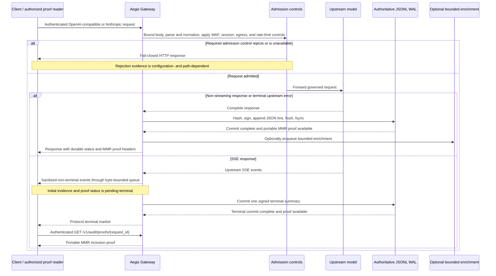

# 🛡️ Aegis Latent Core

> **AI Governance and Cryptographic Evidence Gateway**

**Provider-independent request controls, bounded streaming PII redaction, and client-verifiable Merkle Mountain Range inclusion proofs for governed LLM traffic.**


[](https://github.com/JuanLunaIA/aegis-latent-core/releases/tag/v4.0.2)
[](pyproject.toml)
[](https://pypi.org/project/aegis-latent-sdk/4.0.0/)
[](https://www.npmjs.com/package/aegis-latent-sdk)
[](https://github.com/JuanLunaIA/aegis-latent-core/actions/workflows/ci.yml)
[](https://github.com/JuanLunaIA/aegis-latent-core/actions/workflows/security.yml)
[](scripts/verify_formal_artifacts.sh)
[](evidence/v4_0_0_release_candidate_gate_2026-08-24.md)
[](evidence/v4_0_0_release_candidate_gate_2026-08-24.md)
[](LICENSE)

**Last verified:** 2026-08-27 UTC

**Release baseline:** checked-out source baseline/release target `v4.0.2` with 14 synchronized anchors

**Source baseline/release target:** `4.0.2`, with fourteen synchronized source anchors

**Immutable source comparison:** parent `fdace8844568eb788216740b2cb5daf187d99d3b` has fourteen synchronized `4.0.0` anchors

**External baseline:** the previous public GitHub label `v4.0.1` is a lightweight tag targeting `6469904380218584ae0b5221334bc9a46500f5ba`; its tag workflows failed. PyPI and npm were observed at `4.0.0`, without provenance attribution to those failed workflows.

[**🚀 Local quickstart**](#4-quickstart-for-local-evaluation) · [**🏛️ Architecture**](#5-request-and-evidence-lifecycle) · [**📦 SDKs**](#sdk-registry-and-source-verification) · [**📊 Dashboard**](#6-forensic-audit-dashboard) · [**📑 Enterprise pilot**](#8-commercial-path)

> **Version boundary:** The checked-out source baseline/release target is **`4.0.2`** with fourteen synchronized anchors. Source metadata does not establish external lifecycle state; verify the `v4.0.2` tag, GitHub Release, PyPI and npm artifacts, OCI digest, signature, and attestation through independent readback. Historically, public label `v4.0.1` is a lightweight tag targeting `6469904380218584ae0b5221334bc9a46500f5ba`; its tag-triggered workflows failed, and observed `4.0.0` registry objects have no attributed provenance from those workflows.

## 2. Version and epistemic boundaries

> [!NOTE]
> **Version status.** The repository source and release candidate is `4.0.2`; fourteen release-contract anchors are synchronized at that version. Its immutable parent/source comparison, `fdace8844568eb788216740b2cb5daf187d99d3b`, has fourteen `4.0.0` anchors. The prior public GitHub baseline remains label `v4.0.1`, a lightweight tag targeting `6469904380218584ae0b5221334bc9a46500f5ba`, with failed tag-triggered workflows. PyPI and npm were separately observed at `aegis-latent-sdk` version `4.0.0`, but provenance is not attributed to those failed runs. External `v4.0.2` publication must be established by post-publication readback; source metadata alone does not establish it.

> [!NOTE]
> **Release-envelope readback, 2026-09-01.** A read-only GitHub API readback recorded the following and does not by itself establish registry availability, artifact integrity, or acceptance: the `v4.0.2` GitHub Release exists as a non-draft, non-prerelease entry carrying **31 assets** — `SHA256SUMS`, `release-asset-manifest.json`, two SPDX SBOMs, Python core and SDK wheels plus sdists, the TypeScript tarball, seven `aegis_rust` platform wheels, and a `.sha256` sidecar for each artifact. The annotated tag `v4.0.2` resolves to commit `a6eb58dcc03f8b638c8f3e35f0300f5443a926ca` and carries a Sigstore keyless signature whose certificate identity is the repository's `create_release_tag.yml@refs/heads/main` workflow under issuer `token.actions.githubusercontent.com`.
>
> Three limits apply to that readback and must travel with it. GitHub's native signature check reports the tag as unverified with reason `bad_cert`, which is the expected presentation for short-lived Sigstore certificates and means trust requires `gitsign` or `cosign` validation against the transparency log rather than the GitHub badge. Asset bytes were not downloaded, so `SHA256SUMS` was not checked and no artifact digest was confirmed. PyPI and npm remain observed at `4.0.0`, so the presence of assets in a release envelope is not registry publication.

> [!IMPORTANT]
> **Product boundary.** Aegis is an AI Governance and Evidence Gateway. It can implement tested technical controls and produce structured cryptographic evidence under declared conditions; it is not an LLM, a universal WAF, a compliance certification, a legal-admissibility ruling, a production SLO, or a substitute for network, identity, privacy, retention, incident-response, and deployment controls. Regulatory mappings describe possible technical contributions only and require customer-specific legal, organizational, and technical assessment.

Public claims use distinct evidence states:

| State | Meaning |
|---|---|
| **Implemented** | Source and regression tests establish behavior within stated conditions. |
| **Measured** | A named workload, revision, environment, date, and retained artifact establish a bounded result. |
| **Configuration-dependent** | The control requires validation in the target deployment. |
| **Roadmap** | The capability is incomplete or unmeasured and must not be described as available. |
| **Legal-review-required** | Regulatory, certification, procurement, contractual, and admissibility conclusions remain outside repository evidence. |

Publication does not by itself prove a signed-tag trust path, successful automated provenance workflow, production acceptance, or independent assurance. The controlling references are the [Public Claims Matrix](docs/CLAIMS_MATRIX.md) and [Unsupported Claims Report](docs/institutional/UNSUPPORTED_CLAIMS.md).

## 3. Four technical pillars

> [!NOTE]
> These pillars describe the checked-out `v4.0.2` source baseline/release target. Its fourteen synchronized anchors do not establish external publication or acceptance for a target deployment. The immutable parent comparison `fdace8844568eb788216740b2cb5daf187d99d3b` retains fourteen `4.0.0` anchors.

| Pillar | What the merged source implements | Evidence boundary |
|---|---|---|
| **Durable evidence and portable inclusion proofs** | Governed evidence is committed to the authoritative fsynced JSONL WAL. The core can generate portable `aegis-mmr-inclusion-v1` proofs, and the core plus both SDK verifiers can validate them against an independently trusted root. When the native extension is available, stream terminal records are also copied to a bounded, memory-mapped, CRC32-framed `RustWal`. | The native `RustWal` is an optional auxiliary segment, not the replay authority. A valid proof establishes inclusion relative to the supplied trusted root; it does not establish external immutability, global ordering, timestamping, or legal provenance. See the [MMR proof implementation](aegis/core/mmr.py), [portable-proof tests](tests/test_mmr_portable.py), and [claims matrix](docs/CLAIMS_MATRIX.md). |
| **Bounded streaming redaction and terminal evidence** | Admitted SSE is processed incrementally as sanitized canonical events through a byte-accounted bounded queue. A finite character holdback redacts supported identifier forms that cross chunk boundaries; SHA-256 covers the exact emitted bytes, one terminal summary is committed, and the protocol terminal marker is emitted only after that commit succeeds. | Initial stream evidence and proof status is `pending-terminal`. Queue, event, output, redaction-window, preview, and duration bounds apply per admitted stream; aggregate retained memory still scales with admitted concurrency. This is not a zero-copy claim or universal de-identification guarantee. See the [streaming path](aegis/proxy/streaming.py), [streaming deidentifier](aegis/core/streaming_deidentifier.py), and [streaming regressions](tests/test_proxy_streaming.py). |
| **Tested Python and TypeScript provider integrations** | The checked-out `v4.0.2` source baseline/release target and the separately observed public `4.0.0` packages provide Aegis gateway configuration, tested OpenAI/Anthropic integrations, and portable-proof verification. Python provides official-client subclasses; TypeScript provides provider-native subclasses and gateway-option helpers while retaining the official provider packages as peer dependencies. | Both registries use `aegis-latent-sdk`; Python imports use `aegis_sdk`. Compatibility is limited to tested routes, dependency ranges, and behaviors. Proof verification requires an independently pinned root; streaming proofs are retrieved after terminal commit. See the [Python SDK guide](sdk/python/README.md), [TypeScript SDK guide](sdk/typescript/README.md), and [integration guide](docs/DEVELOPER_INTEGRATIONS_GUIDE.md). |
| **Bounded formal checks of declared invariants** | The formal gate runs Z3 over two SMT-LIB checks, Lean 4 over the durable-before-emission theorem, and TLC over finite-state models for commit-before-emission, append-only ledger prefixes, and session-to-ledger binding. The gate is wired into CI and fails on unexpected solver results, type-check failures, timeouts, or TLC errors. | These artifacts verify their stated formulas and bounded abstractions; they are not a refinement proof of the Python/Rust implementation, target filesystem, or deployment. See the [formal verification guide](docs/formal/FORMAL_VERIFICATION.md), [verification script](scripts/verify_formal_artifacts.sh), and [formal specifications](specs/). |

## 4. Quickstart for local evaluation

The local profile is for development, tests, and evidence replay, not production deployment. Python 3.11 or later is required. Use a pinned checkout to evaluate the complete gateway; the public registries contain the SDKs only.

```bash
git clone https://github.com/JuanLunaIA/aegis-latent-core.git
cd aegis-latent-core
# Check out the exact reviewed 4.0.2 candidate commit before evaluation
python3 -m venv .venv
. .venv/bin/activate
python -m pip install --require-hashes -r requirements.lock
python -m pip install --no-deps -e .
python -m compileall -q aegis aegis_server
pytest -q
```

To start a development gateway against an OpenAI-compatible service listening on `127.0.0.1:9001`, run:

```bash
export AEGIS_SECURITY_ENFORCEMENT_MODE=development
export AEGIS_DEBUG_MODE=true
export AEGIS_AUTH_DISABLED=true
export AEGIS_BACKEND_URL='http://127.0.0.1:9001/v1'
export AEGIS_WAL_PATH='/tmp/aegis-evaluation.wal.jsonl'
aegis
```

There is no `aegis --dev` option. API calls require the configured upstream to be running. The gateway smoke test does not prove provider compatibility, production acceptance, or a production security posture. Do not commit provider keys, gateway bearer tokens, signing secrets, WAL records, or customer payloads. See the [developer quickstart](docs/DEVELOPER_QUICKSTART.md) and [deployment guide](DEPLOYMENT_GUIDE.md) for the complete source-development and deployment gates.

### SDK registry and source verification

The current SDK source version is `4.0.2`; the Python import namespace is `aegis_sdk` and both distributions use the unscoped name `aegis-latent-sdk`. PyPI and npm were last observed at `4.0.0`, without attributed provenance from the failed `v4.0.1` tag workflows. Do not assume `4.0.2` is available from either registry until successful publication and registry readback.

### Python SDK from the source tree

After PyPI successfully publishes and readback confirms version `4.0.2`, install the OpenAI-enabled package with:

```bash
python -m pip install 'aegis-latent-sdk[openai]==4.0.2'
```

Until that readback succeeds, install the candidate from a pinned source checkout:

```bash
python -m pip install './sdk/python[openai]'
```

The wrapper subclasses the official OpenAI client and preserves its native resource and response types within the declared and tested dependency range:

```python
import os

from aegis_sdk.openai import OpenAI

client = OpenAI(
    aegis_api_key=os.environ["AEGIS_API_KEY"],
    gateway_url=os.environ["AEGIS_GATEWAY_URL"],
    tenant_id=os.environ["AEGIS_TENANT_ID"],
)
response = client.chat.completions.create(
    model="gpt-4.1-mini",
    messages=[{"role": "user", "content": "hello"}],
)
```

The SDK also provides `Anthropic`, `AsyncOpenAI`, and `AsyncAnthropic`. Native Anthropic Messages calls require the gateway itself to run with `AEGIS_PROVIDER=anthropic`. Model availability remains upstream-dependent.

### TypeScript SDK from the source tree

After npm successfully publishes and readback confirms version `4.0.2`, install it with the OpenAI peer dependency:

```bash
npm install aegis-latent-sdk@4.0.2 openai@^6.49.0
```

Until that readback succeeds, build and install the candidate from a pinned source checkout:

```bash
npm --prefix sdk/typescript ci
npm --prefix sdk/typescript run build
npm install ./sdk/typescript openai@^6.49.0
```

Use its OpenAI wrapper subpath:

```typescript
import OpenAI from "aegis-latent-sdk/openai";

const client = new OpenAI({
  aegisApiKey: process.env.AEGIS_API_KEY!,
  gatewayUrl: process.env.AEGIS_GATEWAY_URL!,
  tenantId: process.env.AEGIS_TENANT_ID!,
});

const response = await client.chat.completions.create({
  model: "gpt-4.1-mini",
  messages: [{ role: "user", content: "hello" }],
});
```

Both SDKs leave proof verification disabled by default. Enabling `verify_proof` or `verifyProof` also requires an independently provisioned `trusted_mmr_root` or `trustedMmrRoot` containing exactly 64 lowercase hexadecimal characters. A root copied from the same untrusted response is not an independent trust anchor, and an initial `pending-terminal` streaming response is not a terminal inclusion proof. Compatibility is limited to tested routes, behaviors, and dependency ranges; these integrations are not universal replacements for every provider endpoint. For source verification, use the component commands in the [integration guide](docs/DEVELOPER_INTEGRATIONS_GUIDE.md).

## 5. Request and evidence lifecycle

> **Baseline boundary:** The sequence below describes the checked-out `v4.0.2` source baseline/release target. Confirm the exact reviewed commit before deployment; source version metadata does not establish an external `v4.0.2` publication.



For **non-streaming** governed calls, Aegis returns the response only after the signed audit node has been appended to the authoritative JSONL WAL, flushed, and passed to `fsync`. The response reports `X-Aegis-Evidence-Status: durable` and includes `X-Aegis-MMR-*` proof headers when portable proof metadata is present. Optional enrichment is queued only after that authoritative commit. A commit failure prevents a governed success at this evidence boundary.

For merged-source **SSE**, sanitized non-terminal events can be emitted while evidence remains `pending-terminal`. The gateway applies finite event, response-byte, duration, queue, and de-identification bounds while incrementally hashing the canonical emitted bytes. It commits one signed terminal summary before emitting the OpenAI `[DONE]` or Anthropic `message_stop` marker. The initial response links to `/v1/audit/proofs/{request_id}`; an authorized `audit:read` caller can retrieve the proof after terminal commit while the record remains in the retained ledger window.

Not every pre-admission rejection is guaranteed to receive durable evidence. Authentication, WAF, malformed-body, request-bound, session, and rate-limit rejection behavior varies by route and configuration. A successful `fsync` means the process requested operating-system synchronization; it does not by itself prove power-loss durability, replication, immutable external custody, or retention. Likewise, a valid MMR proof establishes inclusion in the declared root, not external timestamping, regulatory compliance, or legal admissibility. See the [architecture and failure semantics](docs/architecture/ARCHITECTURE.md) and [portable MMR proof format](docs/api/MMR_PROOF_V1.md).

## 6. Forensic audit dashboard

> **Distribution boundary:** The [`dashboard`](dashboard) source is present in the checked-out `v4.0.2` source baseline/release target. Its private package uses Next.js 16 and React 19 and consumes the local [`aegis-latent-sdk`](sdk/typescript) workspace dependency. This does not establish a hosted dashboard service or a separately published dashboard package.

The dashboard is a read-only interface for authenticated gateway audit data. It does not substitute sample rows or generated history when data is empty or unavailable.

| Surface | Implemented behavior | Boundary |
|---|---|---|
| **Ledger** | Filters and paginates the retained audit window and exposes restricted-domain RFC 8785 JCS JSON plus deterministic DAG-CBOR evidence identified by CIDv1. | Pagination is offset-based and not snapshot-stable under concurrent appends or eviction. The retained window is not a regulatory WORM store. |
| **MMR explorer** | Retrieves an `aegis-mmr-inclusion-v1` proof, verifies it in the browser with Web Crypto, visualizes the inclusion path and ordered peaks, and provides a local paste-in verification sandbox. | A valid proof establishes inclusion in the named root only. The root requires an independently approved trust channel; the result does not establish event truth, time, retention, or legal status. |
| **Metrics** | Parses an allowlisted set of Aegis values from the current `/metrics` scrape. | A scrape is a current snapshot, not historical telemetry. Missing or malformed data is reported rather than replaced with zero or demo values. |
| **Forensic export** | Reviews a UTC range, operator, acquisition reason, and optional tenant before requesting a bounded ZIP from `POST /v1/audit/forensics/export`. | Production access requires the `audit:export` scope. The export is sensitive technical evidence, not an ISO certification or legal-admissibility determination. |

The bounded export contains `manifest.json`, `ledger_slice.cbor`, `merkle_proof.json`, `audit_certificate.pdf`, and `VERIFY.sh`. The manifest uses the bundle's restricted RFC 8785 JCS domain and records the CIDv1 of the deterministic DAG-CBOR ledger slice. `VERIFY.sh` checks embedded file-byte SHA-256 values; it does not authenticate the archive or independently verify signatures, MMR proofs, canonical encodings, or a trusted root.

```bash
# Run from the repository root.
cd sdk/typescript
npm ci
npm run build

cd ../../dashboard
npm ci
export AEGIS_PRIMARY_BASE_URL='https://aegis.internal'
export AEGIS_DASHBOARD_API_KEY='read-only-audit-token'
npm run dev
```

`AEGIS_DASHBOARD_API_KEY` is consumed by server-side route code and forwarded to the gateway as a bearer token. Deploy the dashboard behind an authenticated reverse proxy and use a dedicated least-privilege audit key. Browser-facing authentication is a deployment responsibility. See the [`dashboard` deployment notes](dashboard/README.md) for production build and verification commands.

## 7. Regulatory contribution matrix

> **Contribution boundary:** Aegis supplies technical controls and evidence paths for customer assessment; it does **not** determine regulatory applicability, establish compliance or certification, create regulatory WORM storage, or decide legal admissibility. The deploying organization and its qualified reviewers remain responsible for scope, configuration, retention, custody, operating effectiveness, and jurisdiction-specific conclusions. See the [compliance contribution map](docs/compliance/COMPLIANCE_MAPPING.md) and [public claims matrix](docs/CLAIMS_MATRIX.md).
>
> **Baseline:** Every implementation path and focused test cited below is present in the checked-out `4.0.2` source baseline. Assess each cited path against the exact revision being deployed rather than against this table.

| Review lens | Technical contribution | Repository evidence | Required boundary |
|---|---|---|---|
| **EU AI Act, Article 12** | Governed request outcomes can produce linked, signed audit records with request/response hashes and event metadata, which may provide technical inputs to a logging analysis. | [`aegis/core/crypto_audit.py`](aegis/core/crypto_audit.py), [`tests/test_enterprise_durable_evidence.py`](tests/test_enterprise_durable_evidence.py) | Article 12 applies to high-risk AI systems in scope. Aegis does not determine classification, conformity, required log content, retention, provider/deployer roles, or operating effectiveness. |
| **HIPAA Privacy Rule, 45 CFR § 164.514** | An opt-in, best-effort text scrubber replaces regex matches for selected forms inspired by Safe Harbor identifier categories and records category/count metadata without the matched values. | [`aegis/core/phi_deidentifier.py`](aegis/core/phi_deidentifier.py), [`tests/test_phi_deidentifier.py`](tests/test_phi_deidentifier.py) | This is **not** the complete Safe Harbor method or Expert Determination. It does not establish removal of all required identifiers, the no-actual-knowledge condition, HIPAA compliance, or suitability for a particular dataset. |
| **MiFID II record keeping** | A standalone helper can create communication records containing content hashes, timestamps, direction, instrument/advice metadata, retention-policy metadata, and optional HMAC protection. | [`aegis/core/mifid_record_keeper.py`](aegis/core/mifid_record_keeper.py), [`tests/test_mifid_record_keeper.py`](tests/test_mifid_record_keeper.py) | The helper cites Articles 16(6)/25(1) and RTS 6/7; it is not wired into the gateway request path. It does not establish RTS 25 clock synchronization, trusted time, record completeness, regulatory WORM, or compliance. |
| **ISO/IEC 27037-oriented evidence handling** | Standalone helpers can package acquisition metadata, custody events, ledger nodes and an integrity seal, and can append sequential HMAC-protected custody-transfer records with `fsync`. | [`aegis/core/iso27037_evidence.py`](aegis/core/iso27037_evidence.py), [`aegis/core/custody_transfer.py`](aegis/core/custody_transfer.py), [`tests/test_iso27037_evidence.py`](tests/test_iso27037_evidence.py), [`tests/test_custody_transfer.py`](tests/test_custody_transfer.py) | These technical artifacts do not establish ISO/IEC conformity, complete chain of custody, examiner competence, external immutability, authorship, or legal admissibility. HMAC is symmetric and depends on customer-controlled key custody. |

External laws, standards, and guidance can change. Qualified counsel or an assessor should verify the applicable text, role, jurisdiction, dataset, deployment, retention policy, clock source, and operating evidence before relying on a contribution mapping.

## 8. Commercial path

> **Commercial boundary.** The checked-out source baseline/release target is `4.0.2`; source metadata does not establish external lifecycle state; verify the tag, GitHub Release, PyPI, npm, OCI digest, signature, and attestation through independent readback. The historical public `v4.0.1` label and observed `4.0.0` registry objects remain distinct baselines. Any evaluation, quote, acceptance plan, and evidence package must identify the exact commit and artifact versions rather than relying on the release label alone.

Aegis is distributed under the terms in [`LICENSE`](LICENSE). A separate commercial agreement may be available for organizations that require terms different from the AGPLv3, but only an executed agreement defines licensing, support, warranty, redistribution, and other contractual rights. [`COMMERCIAL.md`](COMMERCIAL.md) is a procurement summary, not legal advice or an automatic AGPL exemption.

| Package | Directional scope | Commercial boundary |
|---|---|---|
| **Community / OSS** | Self-hosted evaluation and open-source use under AGPLv3, with source, tests, and public documentation | No contractual support, SLA, private onboarding, or customer-specific assurance package. |
| **Team / Pilot** | One named workload; written acceptance criteria; evidence replay; deployment checklist; bounded architecture and implementation assistance | Fixed-scope, time-boxed engagement quoted after scoping; no production SLO, certification, or unlimited engineering promise. |
| **Production** | Commercial self-hosted terms, release updates, deployment guidance, and a defined support window | Annual terms depend on topology, environments, request tier, retention, and support requirements. |
| **Enterprise** | Multiple environments or procurement-heavy deployment, with architecture and security-review assistance plus negotiated response targets | Requires accountable staffing, an operating support model, legal terms, data-handling boundaries, and explicit exclusions. |
| **Sovereign / OEM** | Air-gapped, embedded, redistribution, escrow, or dedicated-assurance requirements | Future/custom only; not a default offer or present assurance commitment. |

The retained planning ranges—**USD 10,000–30,000** for a **4–8 week Team/Pilot**, **USD 40,000–100,000 annually** for Production, and **USD 100,000–250,000+ annually** for Enterprise—are **internal hypotheses to validate**. They are **not public list prices, observed contract values, valuations, or binding offers**. A defensible quote requires the target topology, environments, request volume, providers, streaming profile, retention and residency needs, storage and key custody, support hours, escalation path, security-review scope, geography, and legal entity.

A pilot should use the buyer's actual workload and produce a customer-owned report. Its declared acceptance plan should cover request/response evidence correlation, upstream failure, Redis/rate-limit failure, WAL replay and integrity, key rotation, the pinned WAF corpus, rollback, and the target ingress, storage, secret manager, and container profile. The report should record workload and volume, environment, rejected traffic, evidence completeness, failures, support hours, exclusions, and residual risk. Passing a pilot does not establish certification, regulatory compliance, production SLOs, or legal admissibility.

See [`docs/COMMERCIAL_STRATEGY_US.md`](docs/COMMERCIAL_STRATEGY_US.md) for the packaging hypothesis, [`docs/BUYER_GUIDE_US.md`](docs/BUYER_GUIDE_US.md) for pilot acceptance and procurement blockers, and [`docs/FAQ_PROCUREMENT.md`](docs/FAQ_PROCUREMENT.md) for licensing, pricing, support, and assurance boundaries.

## Related documents — 9. Audience navigation

The checked-out source baseline/release target is **4.0.2** with fourteen synchronized anchors. The prior public **v4.0.1** label targets `6469904380218584ae0b5221334bc9a46500f5ba`; observed registry packages remain **4.0.0** and are not attributed to its failed workflows. Use each document's declared baseline and boundaries. Publication does not establish production acceptance, certification, or legal conclusions.

| Audience | Start here | Scope boundary |
|---|---|---|
| **CISO, AppSec, and security reviewers** | [`SECURITY.md`](SECURITY.md) · [`Threat model`](docs/security/THREAT_MODEL.md) · [`Security FAQ`](docs/FAQ_SECURITY.md) · [`Claims matrix`](docs/CLAIMS_MATRIX.md) | Review implemented controls, evidence locators, deployment dependencies, and residual risk; these documents are not independent assurance or certification. |
| **Developers and AI/ML engineers** | [`Developer quickstart`](docs/DEVELOPER_QUICKSTART.md) · [`Integrations guide`](docs/DEVELOPER_INTEGRATIONS_GUIDE.md) · [`Python SDK source guide`](sdk/python/README.md) · [`TypeScript SDK source guide`](sdk/typescript/README.md) | PyPI and npm were observed at SDK version `4.0.0`; use `4.0.2` registry commands only after successful publication and readback. Validate dependency extras, peer dependencies, trust-root handling, and supported routes for the target integration. |
| **Platform engineering, DevOps, and SRE** | [`Platform operator guide`](docs/PLATFORM_OPERATOR_GUIDE.md) · [`Deployment guide`](DEPLOYMENT_GUIDE.md) · [`Helm chart source`](deploy/helm/Chart.yaml) · [`Backpressure runbook`](docs/operations/BACKPRESSURE_RUNBOOK.md) · [`Key-rotation runbook`](docs/operations/KEY_ROTATION_RUNBOOK.md) · [`Rollback runbook`](docs/operations/ROLLBACK_RUNBOOK.md) | Validate the target kernel, storage, identity, network, signer, Redis, backup, and incident-response environment; repository guidance does not establish a production SLO or target acceptance. |
| **Buyers, procurement, legal, compliance, and privacy reviewers** | [`Buyer guide`](docs/BUYER_GUIDE_US.md) · [`Procurement FAQ`](docs/FAQ_PROCUREMENT.md) · [`Commercial hypotheses`](docs/COMMERCIAL_STRATEGY_US.md) · [`Compliance contribution map`](docs/compliance/COMPLIANCE_MAPPING.md) · [`Data-retention and privacy boundaries`](docs/privacy/DATA_RETENTION.md) | Commercial ranges are non-binding hypotheses. Framework mappings and evidence exports do not establish compliance, certification, legal admissibility, or a universal retention policy. |

## 10. Verified metrics, repository map and integrity

> [!NOTE]
> **Metric scope matters.** The checked-out source baseline/release target is `4.0.2`; source metadata does not establish external lifecycle state; verify the tag, GitHub Release, PyPI, npm, OCI digest, signature, and attestation through independent readback. The historical public `v4.0.1` label and observed `4.0.0` registry objects are separate from the dated candidate evidence below. Candidate figures below come from the retained **2026-08-24** source-candidate gate for commit `2050a310ec295afc61d033ff842c9a535a4f3105`, unless a row says otherwise. Publication-gate documentation was audited on **2026-08-25** at `6469904380218584ae0b5221334bc9a46500f5ba`. These results are regression evidence for named revisions and environments, not production capacity, an SLO, certification, or a legal conclusion.

### Verified metrics

| Scope | Dated, verified result | Boundary |
|---|---|---|
| Python suite | **5,707 passed; 37 skipped** in the retained 2026-08-24 candidate gate | Not a fresh full-suite run on documentation `main`. |
| Python suite, independent re-run | **5,661 passed; 81 skipped; 0 failed** on the `4.0.2` source baseline, 2026-09-01, in a clean container | Skips are uninstalled optional backends (PostgreSQL, DynamoDB, S3, native PQC, GPU), so the count differs from the candidate gate by environment rather than by regression. Recorded in the [cold-start reproduction audit](evidence/cold_start_reproduction_audit_2026-09-01.md). No coverage was measured in that run. |
| Python line coverage | **89.7169%** (14,832/16,532 statements) in the retained 2026-08-24 candidate gate | Candidate-run measurement. CI enforces a 65% floor; this is not an evergreen coverage claim. |
| Ruff | **Lint and format checks passed** in the retained 2026-08-24 candidate gate | This does not imply repository-wide strict typing; the broad strict-mypy audit remained red. |
| Rust extension | **29 release tests passed**; format, Clippy with `-D warnings`, and an abi3 wheel build passed in the candidate gate | Local/CI-equivalent source verification, not registry publication or platform-wide acceptance. |
| SDKs and dashboard | **16 Python SDK tests**, **12 TypeScript SDK tests**, and **6 dashboard tests** passed; configured builds/type checks passed in the candidate gate | PyPI/npm package publication is separately observable at version `4.0.0`; the dashboard has no standalone publication claim. |
| Formal artifacts | **Z3, Lean 4, and TLA+/TLC gate passed** in the candidate gate | Two Z3 formulas, one Lean theorem, and three bounded TLC models. See [`docs/formal/FORMAL_VERIFICATION.md`](docs/formal/FORMAL_VERIFICATION.md); this is not an implementation-refinement or compliance proof. |
| README overhaul branch | On **2026-08-25**, documentation verifier: **27 required files, 0 errors, 0 warnings**; release contract: **14 synchronized `4.0.0` source anchors**; workflow pins: **95 full-SHA references** | Reverified locally after this README rewrite on a branch derived from `6469904380218584ae0b5221334bc9a46500f5ba`. Synchronized source metadata does not publish a release. |

Historical performance and security measurements remain attached to the published v3.1.0 evidence baseline and retain their workload limits; see [`docs/benchmarks/BENCHMARK_RESULTS.md`](docs/benchmarks/BENCHMARK_RESULTS.md). No SLSA level, universal compliance, legal admissibility, zero-copy behavior, or production-readiness conclusion follows from these metrics.

### Repository map

| Path | Purpose |
|---|---|
| [`aegis/proxy/app.py`](aegis/proxy/app.py) | Primary FastAPI gateway lifecycle, admission controls, provider forwarding, evidence commit, and streaming integration. |
| [`aegis/proxy/streaming.py`](aegis/proxy/streaming.py) | Bounded SSE transformation and terminal-evidence ordering. |
| [`aegis/core/crypto_audit.py`](aegis/core/crypto_audit.py) | Authoritative JSONL hash chain, signatures, WAL persistence, replay, and integrity checks. |
| [`aegis/core/mmr.py`](aegis/core/mmr.py) | Merkle Mountain Range state and portable inclusion-proof generation. |
| [`aegis/core/forensic_bundle.py`](aegis/core/forensic_bundle.py) | Bounded forensic ZIP construction and integrity-report artifacts. |
| [`sdk/python/`](sdk/python/) | Local Python SDK source; distribution `aegis-latent-sdk`, import package `aegis_sdk`. |
| [`sdk/typescript/`](sdk/typescript/) | Local unscoped TypeScript package source, `aegis-latent-sdk`; not `@aegis-latent/sdk`. |
| [`dashboard/`](dashboard/) | Private read-only forensic dashboard source; no hosted-service claim. |
| [`tests/`](tests/) | Python regression and release-gate tests. |
| [`specs/`](specs/) | Z3, Lean, and TLA+ formal artifacts. |
| [`.github/workflows/`](.github/workflows/) | CI, security, release, publication, and build workflow definitions. |
| [`docs/REPOSITORY_MAP.md`](docs/REPOSITORY_MAP.md) | Canonical detailed path, package-name, test, and evidence map. |
| [`docs/CLAIMS_MATRIX.md`](docs/CLAIMS_MATRIX.md) | Public-claim status, evidence locators, boundaries, and falsification rules. |
| [`evidence/INDEX.md`](evidence/INDEX.md) | Entry point for retained historical and source-readiness evidence. |

### Integrity and project links

- **Release:** Source baseline/release target `4.0.2` has fourteen synchronized anchors, while source metadata does not establish external lifecycle state; verify the tag, GitHub Release, PyPI, npm, OCI digest, signature, and attestation through independent readback. Historically, `v4.0.1` is a lightweight tag targeting `6469904380218584ae0b5221334bc9a46500f5ba` whose tag workflows failed; registries were observed at `4.0.0` without attributed provenance.
- **Security:** Follow [`SECURITY.md`](SECURITY.md) for supported reporting channels and scope.
- **Contributing:** See [`CONTRIBUTING.md`](CONTRIBUTING.md).
- **License:** Use is governed by [`LICENSE`](LICENSE) and, where applicable, [`COMMERCIAL.md`](COMMERCIAL.md). This README is not legal advice.
- **Repository:** [JuanLunaIA/aegis-latent-core](https://github.com/JuanLunaIA/aegis-latent-core) · [Releases](https://github.com/JuanLunaIA/aegis-latent-core/releases) · [Issues](https://github.com/JuanLunaIA/aegis-latent-core/issues)

Aegis supplies software controls and bounded technical evidence. Deployment acceptance, regulatory applicability, compliance determinations, storage immutability, signer trust, and legal admissibility remain the responsibility of the deploying organization and its qualified reviewers.
