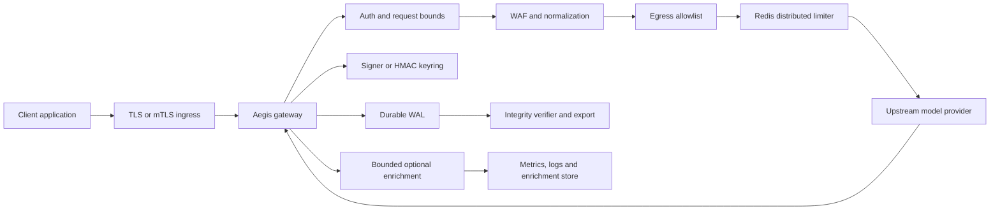
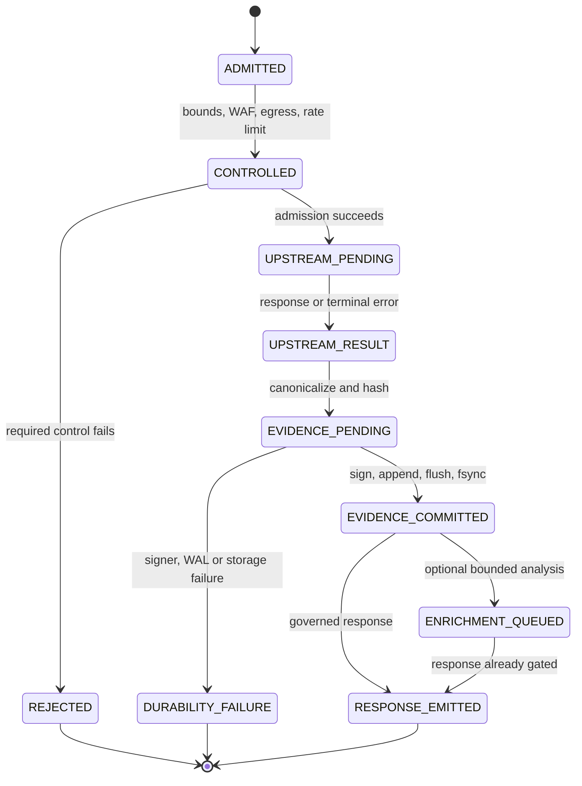

# Architecture — Aegis Latent Core v3.1.0

This document explains the Aegis request lifecycle, evidence boundary, state machine, trust boundaries, topology choices, and failure semantics. It is for platform engineers, security reviewers, developers, and buyer technical evaluators. It describes the current repository boundary and does not claim global ordering, multi-region availability, or regulatory certification.

**Last verified:** 2026-08-18 UTC
**Release baseline:** `v3.1.0`
**Audience:** Engineering, security and architecture review
**Decision record:** [`ADR-001-AI-GOVERNANCE-EVIDENCE-GATEWAY.md`](ADR-001-AI-GOVERNANCE-EVIDENCE-GATEWAY.md)

## System shape

Aegis is an OpenAI-compatible gateway. It sits between an application and an upstream model provider. The gateway evaluates admission controls, forwards admitted traffic, commits a signed evidence record, and emits a governed response only after the durable evidence gate succeeds.

The system boundary ends at the configured process, its storage path, signer path, network controls and declared dependencies. The upstream model, ingress parser, host kernel, secret manager, backup system, customer IAM and external evidence custody are separate boundaries.



The diagram shows request controls before admission, a separate upstream trust boundary, synchronous evidence persistence before governed success, and optional enrichment after the authoritative record.

## Request state machine



The state machine treats `EVIDENCE_COMMITTED` as the authoritative boundary. Optional enrichment cannot move a response backward into a durable state. A failure after admission is not a successful governed response.

## Lifecycle steps

1. The gateway authenticates the caller and assigns a request ID.
2. It reads the request under the configured body bound and canonicalizes the representation.
3. It applies WAF, session, egress and rate-limit controls.
4. It rejects when a required control cannot execute or fails closed.
5. It forwards admitted traffic to the configured upstream provider.
6. It captures the terminal response under the configured streaming policy.
7. It computes request and response hashes and constructs the evidence record.
8. It signs, appends, flushes and synchronizes the WAL.
9. It returns the governed response only after the durable evidence path succeeds.
10. It may enqueue bounded response enrichment after the authoritative record exists.

## Trust boundaries

| Boundary | Asset | Required control | Residual risk |
|---|---|---|---|
| Client to ingress | Credentials and payload | TLS/mTLS, authentication, body limits | Ingress parser and proxy normalization can differ from application parsing |
| Ingress to Aegis | Request semantics | Canonicalization, WAF, request bounds | HTTP/2 fragmentation and translation are not covered by the local corpus |
| Aegis to upstream | Provider request and response | Egress allowlist, TLS, timeout, circuit and provider policy | Provider can retain or process data under its own terms |
| Aegis to Redis | Rate-limit state | TLS, authentication, fail-closed outage behavior | Availability and partition behavior require target acceptance |
| Aegis to signer | Signing authority | Strong signer policy, key custody and rotation | HMAC holders can sign; native PQC timing claim is blocked for verify |
| Aegis to WAL | Evidence bytes | Owner-only path, canonical record, flush and `fsync` | Filesystem, power loss, cloud volume and privileged-host compromise remain |
| Aegis to enrichment | Optional derived analysis | Bounded queue, session serialization and post-commit execution | Enrichment can be stale or rejected; it is not authoritative evidence |
| Release to runtime | Software and dependency provenance | Lockfile, SBOM, workflow provenance, image digest and review | External build/runner and deployment-system risk remains |

## Evidence model

The WAL is an append-only JSONL path under the configured storage location. A committed record binds request and response hashes, chain linkage, Merkle metadata, signature metadata and request identity. The exact schema is implementation-defined and must be verified against the active release code before external integrations depend on it.

`fsync` indicates that the process asked the operating system to synchronize the file descriptor. It does not prove power-loss durability, replicated volume semantics, immutable backup, or external retention. Those properties require target-specific tests.

HMAC-SHA256 is symmetric and classical. A verifier holding the HMAC key can also generate valid MACs. It is not third-party non-repudiation and it is not a post-quantum algorithm. Native ML-DSA-65 is configuration-dependent. The retained timing artifact detected no difference for `sign` under its experiment but detected a difference for `verify`; no constant-time claim is approved.

## Topology guidance

| Topology | Ordering | Key custody | Main failure domain | Not proven |
|---|---|---|---|---|
| Single worker | One local chain | One process or mounted secret | Process, volume, host | HA and global availability |
| Per-pod WAL | Independent per-pod chains | Per-pod or shared key | Pod and volume | Global sequence and cross-pod atomicity |
| Three replicas | Independent local sequence unless centralized | Shared rotation control | Orchestrator, secret manager, storage | Zero-downtime acceptance in a real cluster |
| Central writer | Central order | Writer-owned signer/storage | Writer capacity and availability | Multi-region consensus and recovery |

## Failure semantics

| Failure | Required result | Evidence implication |
|---|---|---|
| Authentication failure | Reject | Record only if the configured rejection evidence path is enabled and successful |
| WAF rejection | Reject | The application boundary decides; ingress parser gaps remain |
| Redis outage | Fail closed or documented `503` | Do not silently use development limiter in strict mode |
| Upstream non-2xx | Durable terminal-error path where configured | A provider error can still be evidence; storage failure remains failure |
| Upstream network error | Durable error path where the evidence boundary is available | No invented successful response |
| Signer failure | Reject governed success | Preserve diagnostics and do not use an unauthorized fallback |
| WAL or `fsync` failure | Reject governed success | Evidence integrity takes precedence over response completion |
| Queue saturation | Reject optional analysis or apply bounded backpressure | Must not erase authoritative evidence |
| Integrity verification failure | Incident state | Preserve original bytes and isolate affected scope |

## Architectural non-goals

Aegis does not replace an ingress proxy, network firewall, identity provider, secret manager, immutable backup, upstream provider contract, privacy program, incident-response team, compliance audit, or legal review. It does not decide whether model output is correct, fair, safe, lawful, or suitable for a business decision.

## Verification paths

```bash
pytest -q tests/test_p0_release_gates.py
pytest -q tests/test_enterprise_durable_evidence.py
pytest -q tests/test_market_hardening_gates.py
python tools/security/run_waf_corpus.py
python tools/benchmarks/run_backpressure_stall.py --offered-rps 10000 --fsync-delay-ms 2
```

These commands verify repository behavior in the declared environment. They do not prove every customer deployment condition.

## Related documents

- [`README.md`](../../README.md)
- [`ADR-001-AI-GOVERNANCE-EVIDENCE-GATEWAY.md`](ADR-001-AI-GOVERNANCE-EVIDENCE-GATEWAY.md)
- [`docs/architecture/README.md`](README.md)
- [`docs/CLAIMS_MATRIX.md`](../CLAIMS_MATRIX.md)
- [`docs/security/THREAT_MODEL.md`](../security/THREAT_MODEL.md)
- [`DEPLOYMENT_GUIDE.md`](../../DEPLOYMENT_GUIDE.md)
