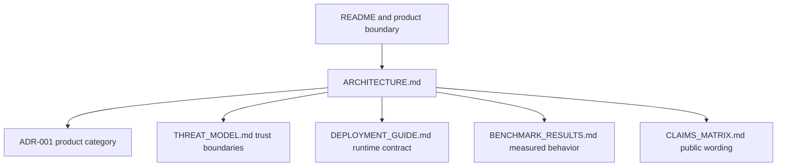

# Aegis Architecture Index — v4.1.0 Source Baseline

This index routes readers to the current architecture description, trust-boundary decisions, state machine, and related operational evidence. It is for engineers, security reviewers, and technical buyers who need a fast route into the system design. The linked documents describe the implemented repository boundary and its residual risks.

**Last verified:** 2026-08-27 UTC
**Release baseline:** four-layer truth model
**Source baseline:** checked-out source metadata is synchronized at `v4.1.0`
**External lifecycle boundary:** source metadata does not prove a tag, GitHub Release, registry package, OCI image, deployment, or acceptance; verify each surface by external readback
**Historical evidence baseline:** retained `v3.1.0` artifacts and measurements remain historical
**Primary architecture document:** [`ARCHITECTURE.md`](ARCHITECTURE.md)

## Start with the full architecture

Read [`docs/architecture/ARCHITECTURE.md`](ARCHITECTURE.md) for the system flow, request state machine, evidence model, trust boundaries, topology table, failure semantics and verification commands.

## Architecture map

The diagram shows the routing relationship between the root entry point and the documents that define implementation, decisions, runtime dependencies, measurements and public claim controls.

## Existing decision records and references

| Document | Question answered |
|---|---|
| [`ARCHITECTURE.md`](ARCHITECTURE.md) | How do requests, controls, evidence and failure states transition? |
| [`ADR-001-AI-GOVERNANCE-EVIDENCE-GATEWAY.md`](ADR-001-AI-GOVERNANCE-EVIDENCE-GATEWAY.md) | Why is Aegis positioned as an evidence gateway rather than a generic AI platform? |
| [`../security/THREAT_MODEL.md`](../security/THREAT_MODEL.md) | What are the assets, trust boundaries and residual risks? |
| [`../../DEPLOYMENT_GUIDE.md`](../../DEPLOYMENT_GUIDE.md) | Which runtime prerequisites must be accepted? |
| [`../CLAIMS_MATRIX.md`](../CLAIMS_MATRIX.md) | Which public statements are implemented, measured, dependent or blocked? |
| [`../benchmarks/BENCHMARK_RESULTS.md`](../benchmarks/BENCHMARK_RESULTS.md) | What did the four market-hardening scenarios actually measure? |
| [`../performance/SCALING_GUIDE.md`](../performance/SCALING_GUIDE.md) | Which topologies and performance boundaries are documented? |

## Architecture boundary

Aegis does not claim global audit ordering, multi-region high availability, universal WAF coverage, constant-time cryptography, immutable storage by application code alone, provider-independent model safety, or regulatory certification. Those claims require separate architecture, evidence, owner and review.

## Related documents

- [`../../README.md`](../../README.md)
- [`ARCHITECTURE.md`](ARCHITECTURE.md)
- [`ADR-001-AI-GOVERNANCE-EVIDENCE-GATEWAY.md`](ADR-001-AI-GOVERNANCE-EVIDENCE-GATEWAY.md)
- [`../CLAIMS_MATRIX.md`](../CLAIMS_MATRIX.md)
- [`../security/THREAT_MODEL.md`](../security/THREAT_MODEL.md)
- [`../../DEPLOYMENT_GUIDE.md`](../../DEPLOYMENT_GUIDE.md)
