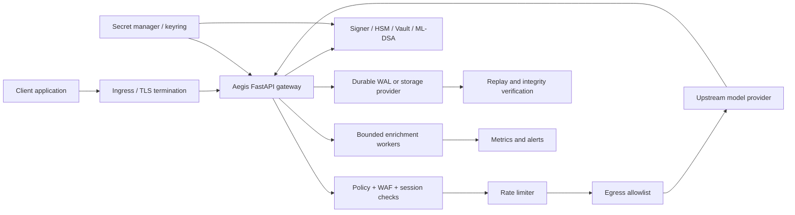

# Aegis Architecture

Aegis is an **AI Governance and Evidence Gateway**. Its architectural center is not model inference; it is the controlled transition from an authenticated request to a policy decision, upstream response, durable evidence record, and observable terminal response.

## System boundary



## Trust boundaries

| Boundary | Asset | Required control | Residual risk |
|---|---|---|---|
| Client → ingress | API credentials and request bytes | TLS, authentication, request-size bounds, trusted proxy configuration | Misconfigured ingress or forwarded headers can change the effective client boundary. |
| Ingress → Aegis | Normalized HTTP request | Explicit HTTP/2 termination ownership, parser limits, WAF and canonicalization | HTTP/2 parser behavior before Aegis is outside the application boundary. |
| Aegis → upstream | Provider credentials and governed request | Egress allowlist, TLS, upstream timeout/circuit controls, no credential logging | Provider availability and upstream-side retention remain external. |
| Aegis → signer | Hashes and signing policy | HSM/Vault or protected keyring, key IDs, atomic reload, no secret logging | Secret manager, crypto implementation, and deployment custody require independent validation. |
| Aegis → WAL/storage | Evidence records and chain links | Owner-only permissions, append-only policy, fsync/transaction commit, replay verification | Storage/controller semantics and backup immutability depend on deployment. |
| Gateway → enrichment | Optional analysis work | Bounded queue, explicit rejection/metrics, no evidence dependency | Enrichment can be delayed or dropped without changing authoritative evidence. |
| Operator → system | Configuration and release controls | Least privilege, signed release, provenance, audit events, rollback | Human procedures and access governance remain organizational controls. |

## Request state machine

```text
ADMITTED
  -> POLICY_ALLOWED
  -> UPSTREAM_COMPLETE
  -> EVIDENCE_SIGNED
  -> EVIDENCE_DURABLE
  -> RESPONSE_EMITTED

Any required-control failure before the evidence boundary
  -> FAIL_CLOSED_REJECTION
  -> DURABLE_ERROR_EVIDENCE when the evidence boundary is available

Optional enrichment failure
  -> ENRICHMENT_REJECTED or ENRICHMENT_FAILED
  -> authoritative evidence remains valid
```

The invariant is: **a governed accepted response must map to exactly one durable authoritative evidence record within the declared scope**. A non-governed rejection before the evidence boundary must remain distinguishable from a governed terminal response.

## Topology guidance

A single worker with one durable WAL is the smallest verifiable topology. One worker per pod creates independent evidence bundles and must not be described as globally ordered. Three replicas can share a versioned signer keyring and exercise zero-restart rotation, but cross-replica ordering still requires a centralized writer or an explicitly designed ordering service.

## Decision records

- [`ADR-001-AI-GOVERNANCE-EVIDENCE-GATEWAY.md`](ADR-001-AI-GOVERNANCE-EVIDENCE-GATEWAY.md) defines the product category and claim boundary.
- [`../CLAIMS_MATRIX.md`](../CLAIMS_MATRIX.md) controls public language.
- [`../operations/BACKPRESSURE_RUNBOOK.md`](../operations/BACKPRESSURE_RUNBOOK.md) defines I/O stall and queue semantics.
- [`../operations/KEY_ROTATION_RUNBOOK.md`](../operations/KEY_ROTATION_RUNBOOK.md) defines key overlap and rollback.

## Design non-goals

The architecture does not claim a universal WAF, universal regulatory compliance, immutable storage by application code alone, global multi-region order, constant-time cryptography, or provider-independent model safety. Each requires its own boundary, artifact, owner, and review.
